# TensorFlow Lite

**Fecha**: 13/12/2023

En este repositorio se va a tratar de documentar y almacenar el ejemplo tomado de:
1. Intro to TinyML Part 1: Training a Model for Arduino in TensorFlow ([link](https://www.digikey.com/en/maker/projects/intro-to-tinyml-part-1-training-a-model-for-arduino-in-tensorflow/8f1fc8c0b83d417ab521c48864d2a8ec))
2. Intro to TinyML Part 2: Deploying a TensorFlow Lite Model to Arduino ([link](https://www.digikey.com/en/maker/projects/intro-to-tinyml-part-2-deploying-a-tensorflow-lite-model-to-arduino/59bf2d67256f4b40900a3fa670c14330)). 

## Sobre el ejemplo

### Enunciado

Crear un red neuronal de tres capas que prediga la salida de una función seno $y = \sin(x)$ con $0\leq x \leq 2\pi$. La siguiente figura (tomada de la pagina del autor) resume el modelo:

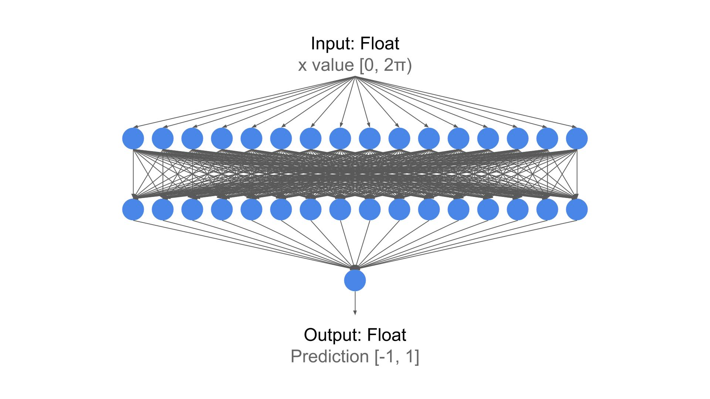

El siguiente diagrama resume le modelo:

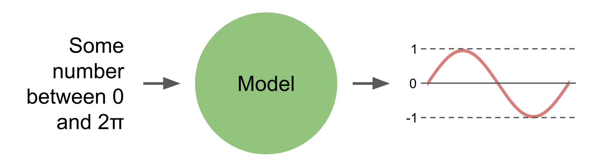

La siguiente figura resume el esquema de trabajo:
1. Crear y entrenar el modelo usando TensorFlow.
2. Convertir el modelo creado usando el TensorFlow Lite converter. El resultado de esta operación será un modelo **tflite**.
3. Almacenar el modelo **tflite** como un arreglo de bytes en una matriz de constantes en lenguaje C (archivo .c y .h). Esta matriz será la que permitirá cargar el modelo y usarlo para realizar las inferencias por medio de la biblioteca TensorFlow Lite para microcontroladores.  

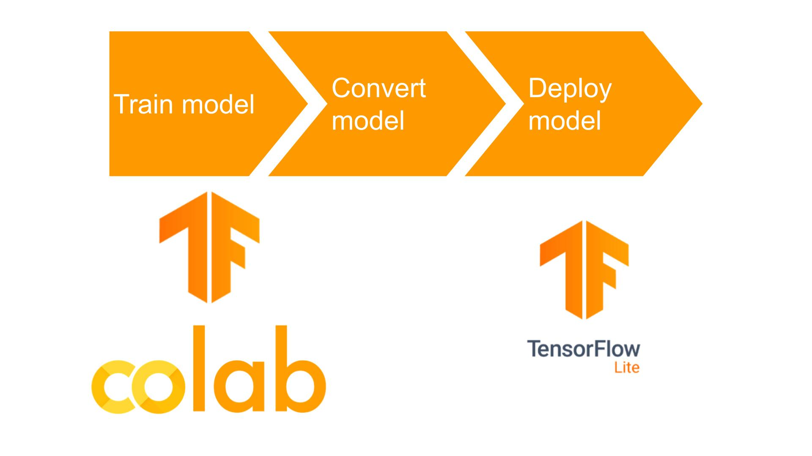

Veamos cada parte del procedimiento.

## Parte 1 - Desarrollo del modelo

### Requerimientos previos

Para realizar el desarrollo de manera local se siguió el tutorial **Getting Started with Machine Learning Using TensorFlow and Keras** ([link](https://www.digikey.com/en/maker/projects/getting-started-with-machine-learning-using-tensorflow-and-keras/0746640deea84313998f5f95c8206e5b)). La instalación se hizo sin soporte para gpu pues nuestra maquina es una peye.

El notebook ejemplo tomado de la referencia guia es [test.ipynb](test.ipynb). Los resultados son algo similares a los esperados por lo que ahora asumiremos que dió. A continuación se muestra el notebook abierto en VSCode:

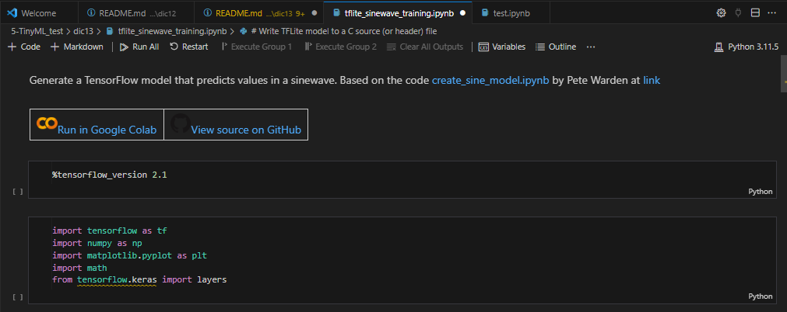

> **Importante**: While you can play around with various machine learning algorithms in Colab, you’re limited in VM resources and time. If you don’t engage with the interface for 90 min, you will be disconnected, and every 12 hours, the runtime will reset.

### Manos a la obra

El notebook empleado es el mismo que se da en la pagina original donde se explica el video ([link](https://www.digikey.com/en/maker/projects/intro-to-tinyml-part-1-training-a-model-for-arduino-in-tensorflow/8f1fc8c0b83d417ab521c48864d2a8ec)). El notebook proporsionado por el autor del tutorial se agrego en el presente repositorio como [tflite-sinewave-training.ipynb](tflite_sinewave_training.ipynb).  Lo unico que se hizo fue probar el ejemplo tanto localmente como en colab. En la siguiente figura se muestran el notebook localmente:

En esta otra imagen, se muestra el notebook ejecutado en colab:

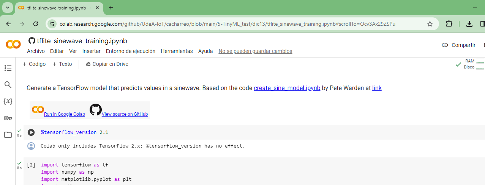

Cuando se ejecuta el notebook, uno de los resultados finales es el modelo de TensorFlow Lite (**sine_model.h** y **sine_model.tflite**). Cuando se corrieron los modelos local y en colab, los resultados del ultimo fueron mejores por lo que se descargo el modelo. 

Primero se corrio el notebook localmente, generandose los archivos **sine_model.h** y **sine_model.tflite** los cuales fueron renombrados como [sine_model_local.h](sine_model_local.h) y [sine_model_local.tflite](sine_model_local.tflite). Luego, se ejecuto el notebook en colab y se descargaron los modelos resultantes [sine_model.h](sine_model.h) y [sine_model.tflite](sine_model.tflite). A continuación se muestran los archivos generados.

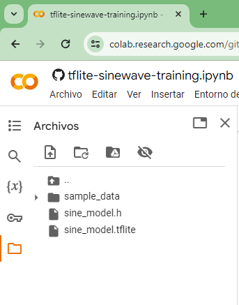

Luego, se descargan los archivos.

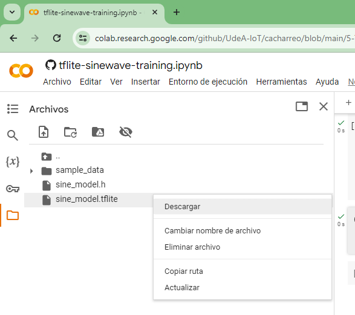

En la siguiente imagen se muestra la matriz C con el modelo:

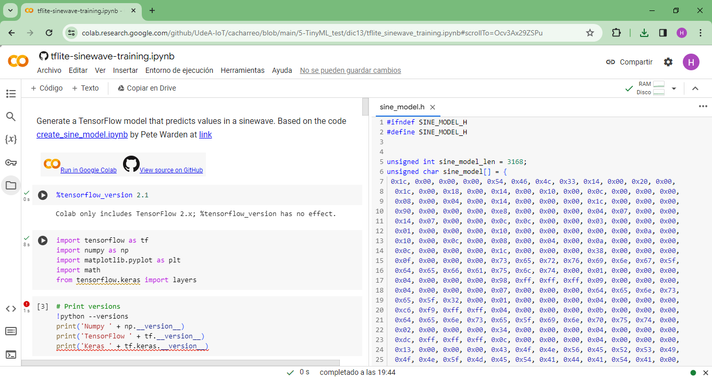

El resultado del modelo ejecutado en colab fue mejor.

Finalmente, para visualizar (tal y como recomendo el autor) como es el modelo se uso [neutron](https://netron.app/) (cuyo repo se encuentra en el siguiente [link](https://github.com/lutzroeder/netron)). 

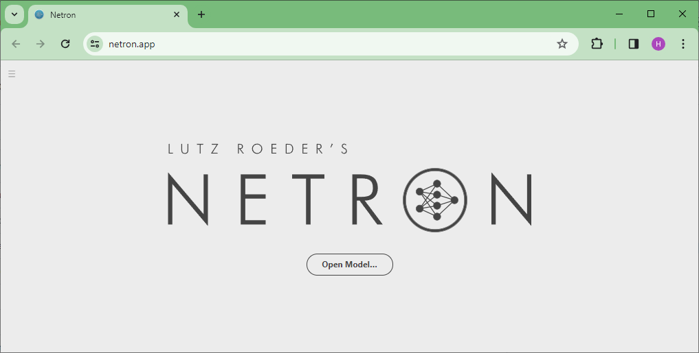

Para esto inicialmente se sube el archivo **.tflite** ([sine_model.tflite](sine_model.tflite)) del modelo. 

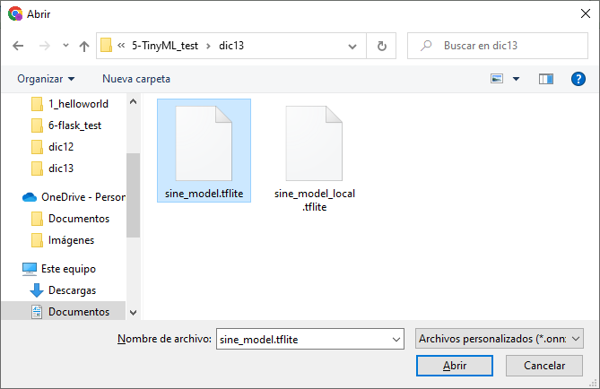

Luego, una vez se carga el modelo, el resultado se muestra a continuación:

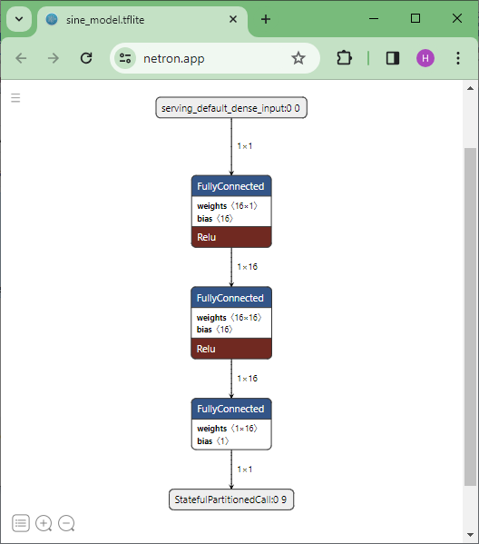

Se puede comprender mejor el modelo explorando la aplicación tal y como se muestra a continuación:

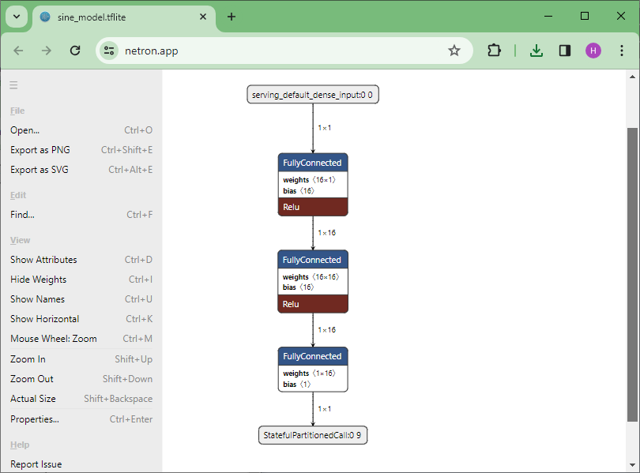

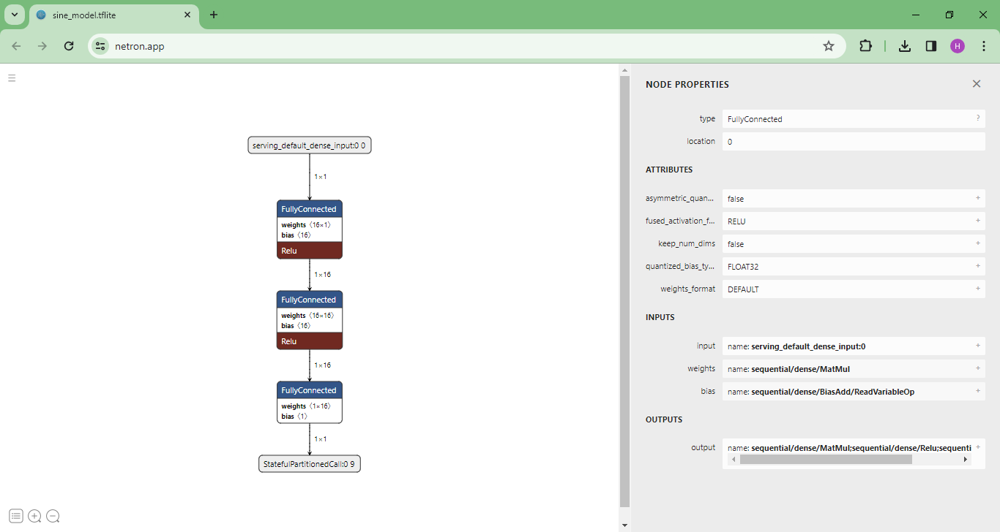

En la siguiente figura tomada del siguiente [link](https://medium.com/swlh/icon-classifier-with-tflite-model-maker-9263c0021f72) se resume el proceso de trabajo realizado anteriormente:

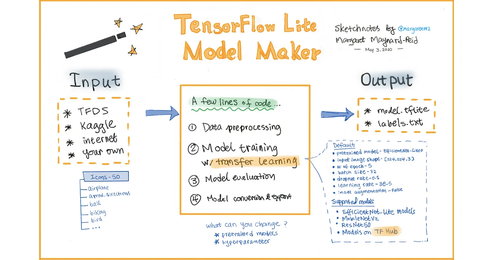

## Mas herramientas

1. https://playground.tensorflow.org/
2. https://github.com/ashishpatel26/Tools-to-Design-or-Visualize-Architecture-of-Neural-Network
3. https://siliconlabs.github.io/mltk/docs/guides/model_visualizer.html
4. https://forums.fast.ai/t/visualizer-for-deep-learning-and-machine-learning-models-for-your-debugging-papers-and-presentations/29428

## Referencias adicionales

1. https://www.digikey.com/en/maker/projects/tinyml-getting-started-with-tensorflow-lite-for-microcontrollers/c0cdd850f5004b098d263400aa294023
2. https://www.digikey.com/en/maker/tutorials/2016/beginners-guide-to-github
3. https://www.digikey.com/en/maker/projects/case-from-the-newly-released-tinyml-cookbook/4c591cef67884f6e8000e1376dd0125f
4. https://www.digikey.com/en/maker/projects/tensorflow-lite-for-microcontrollers-kit-quickstart/1b372b69e44f4d988b5363741a61882d
5. https://www.digikey.com/en/maker/projects/tiny-ml-for-big-hearts-on-an-8-bit-microcontroller/63a7062f54b8483e8c2c3331a44760b2
6. https://www.digikey.com/en/maker/projects/how-to-train-new-tensorflow-lite-micro-speech-models/e9480d4a38264604a2bf0336ce11aa9e
7. https://www.digikey.com/en/maker/projects/tensorflow-lite-tutorial-part-1-wake-word-feature-extraction/54e1ce8520154081a58feb301ef9d87a
8. https://www.digikey.com/en/maker/projects/tensorflow-lite-tutorial-part-2-speech-recognition-model-training/d8d04a2b60a442cf8c3fa5c0dd2a292b
9. https://www.digikey.com/en/maker/projects/tensorflow-lite-tutorial-part-3-speech-recognition-on-raspberry-pi/8a2dc7d8a9a947b4a953d37d3b271c71
10. https://www.digikey.com/en/maker/projects/case-from-the-newly-released-tinyml-cookbook/4c591cef67884f6e8000e1376dd0125f

