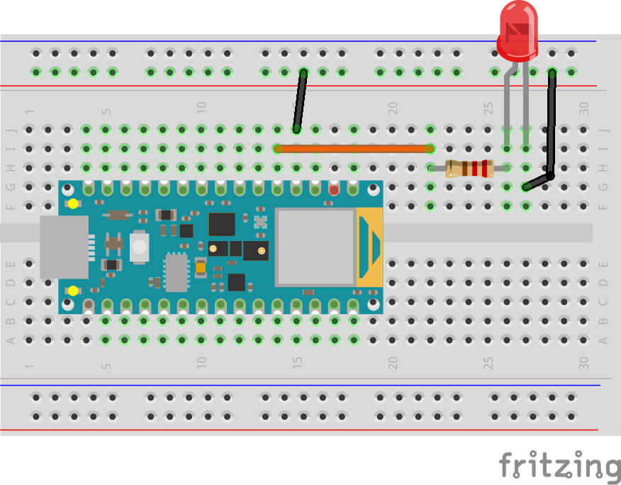
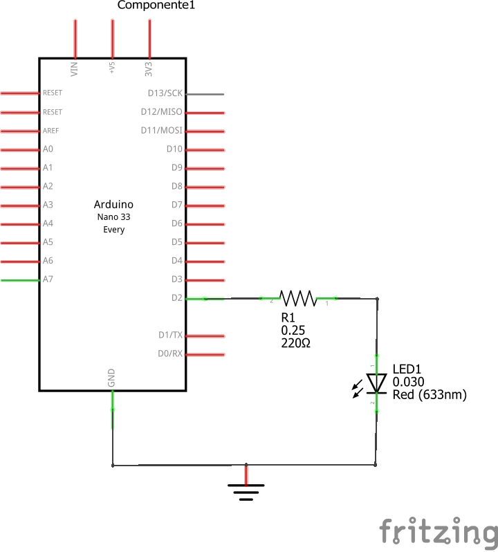

# Hello World en el microcontrolador

En esta parte se describirá como cargar el modelo en el Arduino Nano usando la libreria TensorFlow Lite for Microcontrolers. En este ejemplo, el modelo descargado en el micro llevara a cabo una inferencia para generar una señal aproximada de la función seno.


Antes de descargar el modelo en el micro, fue necesario entrenarlo usando Tensor Flow Lite ([tflite_sinewave_training.ipynb](../tflite_sinewave_training.ipynb)). El resultado final fue un archivo cabecera .h ([sine_model.h](../sine_model.h)) el cual contiene el mdoelo que será cargado en el programa en C.


Para usar el modelo, es necerario incluirlo (wrap) en un código que configure permita usarlo en el microcontrolador para obtener el comportamiento deseado.


A continuación se describirá el procedimiento para desarrollar una aplicación embebida que usa el modelo (funcion seno en nuestro caso) para controlar la intensidad del brillo de un led de acuerdo a la señal seno generada por el modelo.

## Hardware

La plataforma a usar sera un  Arduino Nano 33 BLE Sense ([link](https://store-usa.arduino.cc/products/arduino-nano-33-ble-sense?selectedStore=us)).


Los compentes necesarios para el montaje son:

|#|Componente|Cantidad|
|---|---|---|
|1|Arduino Nano 33 BLE Sense|1|
|2|Resistencia de 220|1|
|3|Led|1|

A continuación se muestra el diagrama de conexiones:



Finalmente, se muestra el esquematico asociado.



## Desarrollo de la aplicación - Sofware

Con los elementos de hardware listos, se procede a desarrollar el software. En el caso vamos a dividir el analisis del programa en varias partes:
* Incluir dependencias
* Declarar variables globales.
* Inicializar (setup)
* Programa principal (loop)

El programa completo se encuentra en el directorio: [nano_33_ble_tflite_sine](nano_33_ble_tflite_sine/) y tiene los siguientes doe archivos:
* [sine_model.h](nano_33_ble_tflite_sine/sine_model.h): Matriz con el modelo entrenado usando Tensor Flow Lite.
* [nano_33_ble_tflite_sine.ino](nano_33_ble_tflite_sine/nano_33_ble_tflite_sine.ino): Programa que se ejecutará en el microcontrolador para cambiar el brillo del led de acuerdo a la salida de la funcion seno aprendida por el modelo.

A continuación se abordarán las principales partes del código [nano_33_ble_tflite_sine.ino](nano_33_ble_tflite_sine/nano_33_ble_tflite_sine.ino).

### Incluir dependencias

Se resume en dos pasos principales:

1. Incluir los encabezados de TensorFlow Lite for Microcontrollers:

    ```c++
    // Tensor Flow Lite Headers
    #include <TensorFlowLite.h>
    
    #include "tensorflow/lite/micro/all_ops_resolver.h"
    #include "tensorflow/lite/micro/micro_error_reporter.h"
    #include "tensorflow/lite/micro/micro_interpreter.h"
    #include "tensorflow/lite/schema/schema_generated.h"
    #include "tensorflow/lite/version.h"
    
    #include "tensorflow/lite/c/common.h"
    ...
    ```

2. Incluir el encabezado del modelo:

    
    ```c++
    ...
    // Our model
    #include "sine_model.h"
    ...
    ```

### Variables globales

En esta parte, se definen las variables globales de la aplicación. Para el ejemplo se tienen:

1. Variables globales asociadas a la aplicación en cuestión:
  
   ```c++
   ...
   // Some settings
   constexpr int led_pin = 2;
   constexpr float pi = 3.14159265;                  // Some pi
   constexpr float freq = 100;                       // Frequency (Hz) of sinewave
   constexpr float period = (1 / freq) * (1000000);  // Period (microseconds)
   ...
   ```
  
2. Apuntadores a estructuras de datos y clases propias de Tensor Flow Lite:

   ```c++
   ...
   // TFLite globals, used for compatibility with Arduino-style sketches
   namespace {
     tflite::ErrorReporter* error_reporter = nullptr;
     const tflite::Model* model = nullptr;
     tflite::MicroInterpreter* interpreter = nullptr;
     TfLiteTensor* model_input = nullptr;
     TfLiteTensor* model_output = nullptr;

     // Create an area of memory to use for input, output, and other TensorFlow
     // arrays. You'll need to adjust this by combiling, running, and looking
     // for errors.
     constexpr int kTensorArenaSize = 5 * 1024;
     uint8_t tensor_arena[kTensorArenaSize];
   } // namespace
   ...
   ```

   En la parte anterior, hay dos lineas de código muy importantes las cuales son:

   ```c++
   ...
   constexpr int kTensorArenaSize = 5 * 1024;
   uint8_t tensor_arena[kTensorArenaSize];
   ...
   ```
     
   En estas lineas lo que se hace es definir la **Tensor Arena**. Esta es un area de memoria que se asocia al modelo para que este pueda ejecutarse. El tamaño no tiene que ser exacto y como no se tiene certeza de que tanto se necesita, este se define a ensayo y error teniendo en cuenta de respetar las limitaciones de memoria del microcontrolador. Un tip es elegir el tamaño de la forma $n\times 1024$, comenzando por un valor alto como punto de partida para que el modelo funcione y luego bajandolo hasta que el modelo no ejecute. El ultimo numero menor para el cual el modelo funcionó el tamaño correspondiente de la **Tensor Arena**.

El código que comprende las dos partes tratadas anteriormente se muestra a continuación:

```c++
// Import TensorFlow stuff
#include <TensorFlowLite.h>

#include "tensorflow/lite/micro/all_ops_resolver.h"
#include "tensorflow/lite/micro/micro_error_reporter.h"
#include "tensorflow/lite/micro/micro_interpreter.h"
#include "tensorflow/lite/schema/schema_generated.h"

#include "tensorflow/lite/c/common.h"
#include "tensorflow/lite/version.h"

// Our model
#include "sine_model.h"


// Figure out what's going on in our model
#define DEBUG 1


// Some settings
constexpr int led_pin = 2;
constexpr float pi = 3.14159265;                  // Some pi
constexpr float freq = 0.5;                       // Frequency (Hz) of sinewave
constexpr float period = (1 / freq) * (1000000);  // Period (microseconds)

// TFLite globals, used for compatibility with Arduino-style sketches
namespace {
  tflite::ErrorReporter* error_reporter = nullptr;
  const tflite::Model* model = nullptr;
  tflite::MicroInterpreter* interpreter = nullptr;
  TfLiteTensor* model_input = nullptr;
  TfLiteTensor* model_output = nullptr;

  // Create an area of memory to use for input, output, and other TensorFlow
  // arrays. You'll need to adjust this by combiling, running, and looking
  // for errors.
  constexpr int kTensorArenaSize = 5*1024;
  uint8_t tensor_arena[kTensorArenaSize];
} // namespace
```

### Inicialización

Esta parte esta asociada al codigo que se coloca en la función de inicialización (```setup()```):


```c++
void setup() {
  
  // Wait for Serial to connect
  #if DEBUG
    while(!Serial);  
  #endif

  // Let's make an LED vary in brightness
  pinMode(led_pin, OUTPUT);

  // Set up logging (will report to Serial, even within TFLite functions)
  static tflite::MicroErrorReporter micro_error_reporter;
  error_reporter = &micro_error_reporter;

  // Map the model into a usable data structure
  model = tflite::GetModel(sine_model);
  if (model->version() != TFLITE_SCHEMA_VERSION) {
    TF_LITE_REPORT_ERROR(error_reporter,
                         "Model provided is schema version %d not equal "
                         "to supported version %d.",
                         model->version(), TFLITE_SCHEMA_VERSION);
    return;
  }

  // This pulls in all the operation implementations we need.
  // NOLINTNEXTLINE(runtime-global-variables)
  static tflite::AllOpsResolver resolver;

  // Build an interpreter to run the model with.
  static tflite::MicroInterpreter static_interpreter(
      model, resolver, tensor_arena, kTensorArenaSize, error_reporter);
  interpreter = &static_interpreter;

   // Allocate memory from the tensor_arena for the model's tensors.
  TfLiteStatus allocate_status = interpreter->AllocateTensors();
  if (allocate_status != kTfLiteOk) {
    TF_LITE_REPORT_ERROR(error_reporter, "AllocateTensors() failed");
    return;
  }

  // Obtain pointers to the model's input and output tensors.
  model_input = interpreter->input(0);
  model_output = interpreter->output(0);

  #if DEBUG
    Serial.print("Number of dimensions: ");
    Serial.println(model_input->dims->size);
    Serial.print("Dim 1 size: ");
    Serial.println(model_input->dims->data[0]);
    Serial.print("Dim 2 size: ");
    Serial.println(model_input->dims->data[1]);
    Serial.print("Input type: ");
    Serial.println(model_input->type);
  #endif
}
```

A continuación, se habla brevemente de las principales partes del código anteriormente mostrado:

1. **Inicialización de los modulos del microcontrolador**: En está parte se configuran los modulos del microcontrolador asi como los puertos de entrada y salida. Para el caso solo se hizo enfasis en la inicialización del puerto que se conectará al LED:
   
   
   ```c++
   ...
   // Let's make an LED vary in brightness
   pinMode(led_pin, OUTPUT);
   ...
   ```

2. **Configurar un registro para logging**: Cuando se desarrolla una aplicación para una placa de desarrollo, una de las cosas mas importantes es el proceso de debugging. Normalmente, este procedimiento se desarrolla imprimiendo mensajes haciendo uso de la interfaz serial. Tensor Flow Lite posee diferentes funciones y clases para facilitar esta tarea. Para esto, lo que se suele hacer es usar una instancia de la clase MicroErrorReporter definida en [micro_error_reporter.h](https://github.com/biagiom/tflite-micro-lib/blob/master/tensorflow/lite/core/api/error_reporter.h). 
   

   ```c++
   ...
   // Set up logging (will report to Serial, even within TFLite functions)
   static tflite::MicroErrorReporter micro_error_reporter;
   error_reporter = &micro_error_reporter;
   ...
   ```

3. **Mapear el modelo**: En esta parte lo que se hace es tomar el matriz asociada al modelo (definida en el archivo [sine_model.h](./nano_33_ble_tflite_sine/sine_model.h)) y pasarla mediante el metodo ```GetModel()``` el cual retorna un puntero (a una estructura ```Model``` definida en [schema_generated.h](https://github.com/tensorflow/tensorflow/blob/master/tensorflow/lite/schema/schema_generated.h)) con la representación del modelo.


   ```c++
   ...
   // Map the model into a usable data structure
   model = tflite::GetModel(sine_model);
   ...
   ```

4. Creación de un **```AllOpsResolver```**: El siguiente paso es la creación de una instancia de la clase ```AllOpsResolver``` (**Duda**: Parece que cambio en la implementación nueva. Ver siguiente [link](https://github.com/arduino/ArduinoTensorFlowLiteTutorials/issues/15)). Esta clase permite al interprete de Tensor Flow Lite for microcontrolers acceder a todas las *operaciones* de machine learning (llevadas a cabo para realizar la transformación de las entradas en salidas) ejecutadas por el modelo.  
  
   ```c++
   ...
   // This pulls in all the operation implementations we need.
   // NOLINTNEXTLINE(runtime-global-variables)
   static tflite::AllOpsResolver resolver;
   ...
   ```

5. **Inicializar el interprete**: En esta parte se crea un objeto de la clase ```MicroInterpreter```. Esta clase es el corazon de TensorFlow Lite for Microcontrollers y constituye la pieza magica de codigo que ejecutará el modelo con los datos que se le pasen. Como se puede ver, al microinterprete se le pasan la mayoria de todos los objetos que se han creado: 
      
   ```c++
   ...
   // Build an interpreter to run the model with.
   static tflite::MicroInterpreter static_interpreter(
      model, resolver, tensor_arena, kTensorArenaSize, error_reporter);
   interpreter = &static_interpreter;
   ...
   ```
   
   Posteriormente, posteriormente el microinterprete hace una llamada al método ```AllocateTensors()```. Este metodo recorre todos los tensores definidos por el modelo y asigna, a cada uno de ellos, memoria en el **Tensor Arena**. Es fundamental llamar ```AllocateTensors()``` antes de intentar ejecutar la inferencia, porque de lo contrario la inferencia fallará.

   ```c++
   ...
   // Allocate memory from the tensor_arena for the model's tensors.
   TfLiteStatus allocate_status = interpreter->AllocateTensors();
   if (allocate_status != kTfLiteOk) {
     TF_LITE_REPORT_ERROR(error_reporter, "AllocateTensors() failed");
     return;
   }
   ...
   ```

6. **Definir entradas y salidas del modelo**: 

   ```c++
   ...
   // Obtain pointers to the model's input and output tensors.
   model_input = interpreter->input(0);
   model_output = interpreter->output(0);
   ...
   ```

### Main loop

Una vez las variables necesarias han sido inicializadas se procede a la implementación de la funcion ```loop()```. A continuación se muestra la implementación realizada:

```c++
void loop() {
  // put your main code here, to run repeatedly:
  #if DEBUG
    unsigned long start_timestamp = micros();
  #endif

  // Get current timestamp and modulo with period
  unsigned long timestamp = micros();
  timestamp = timestamp % (unsigned long)period;

  // Calculate x value to feed to the model
  float x_val = ((float)timestamp * 2 * pi) / period;

  // Copy value to input buffer (tensor)  
  model_input->data.f[0] = x_val;

  // Run inference, and report any error
  TfLiteStatus invoke_status = interpreter->Invoke();
  if (invoke_status != kTfLiteOk) {
    TF_LITE_REPORT_ERROR(error_reporter, "Invoke failed on x: %f\n",
                         static_cast<double>(x_val));
    return;
  }

  // Read predicted y value from output buffer (tensor)
  float y_val = model_output->data.f[0];

  // Translate to a PWM LED brightness
  int brightness = (int)(255 * y_val);
  analogWrite(led_pin, brightness);

  // Print value
  Serial.println(y_val);

  #if DEBUG
    Serial.print("Time for inference (us): ");
    Serial.println(micros() - start_timestamp);
  #endif
}
```

En esta basicamente, la logica principal implementada fue basicamente lo siguiente:
1. Generar valores temporales en la variable ```timestamp``` ($t$) entre 0 y el perido: $0 \le t \le T$.
   
   ```c++
   ...
   // Get current timestamp and modulo with period
   unsigned long timestamp = micros();
   timestamp = timestamp % (unsigned long)period;   
   ...
   ```

2. Generar los valores de la variable ```x_val``` tal que $0 \le x_{val} \le 2\pi$.

   ```c++
   ...
   // Calculate x value to feed to the model
   float x_val = ((float)timestamp * 2 * pi) / period;
   ...   
   ```

3. Copiar el valor generado en el tensor de entrada.
   
   ```c++
   ...
   // Copy value to input buffer (tensor)  
   model_input->data.f[0] = x_val;
   ...
   ```

4. Generar la inferencia y copiar el valor inferido por el modelo, basicamente: $y_{val}=\sin(x_{val})$

   ```c++
   ...
   // Run inference, and report any error
   TfLiteStatus invoke_status = interpreter->Invoke();
   if (invoke_status != kTfLiteOk) {
     error_reporter->Report("Invoke failed on x_val: %f\n",
                            static_cast<double>(x_val));
     return;
   }
   // Read predicted y value from output buffer (tensor)
   float y_val = model_output->data.f[0];
   ...
   ```

5. Reescalar los resultados de la salida $y_{val}\in[-1,1]$ a un variable entera ```brightness``` dentro del rango $[-255,255]$. Luego, mediante la función ```analogWrite()``` modificar la intensidad del led.

   ```c++
   ...
   // Translate to a PWM LED brightness
   int brightness = (int)(255 * y_val);
   analogWrite(led_pin, brightness);
   ...
   ```

6. Imprimir el valor de la salida ```y_val``` del modelo serialmente. 

   ```c++
   ...
   // Print value
   Serial.println(y_val);
   ...
   ```

Es importante agregar que para propositos de debug se emplearon otras instrucciones las cuales no se describieron con detalle anteriormente.

## Pruebas

Las pruebas realizadas a continuación tratan de documentar las pruebas realizadas en el video **Introducción a TinyML Parte 2: Implementación de un modelo TensorFlow Lite en Arduino | Electrónica Digi-Key** ([link](https://www.youtube.com/watch?v=dU01M61RW8s)) del autor de la guia que se tomo como base de esta.

### Prueba 1

Con el debug activado (```#define DEBUG 1```) se agrego al final de la función ```loop()``` un delay de 1 segundo y se observo la salida:


### Prueba 2

Se probaron diversos tamaños para la región **Tensor Arena**. La siguiente tabla resume los resultados:

|Test|Tensor Arena|Linea de codigo modificada|Resultado|
|---|---|---|---|
|1|$5\times1024$|```constexpr int kTensorArenaSize = 5 * 1024;```|Funciono bien|
|2|$1\times1024$|```constexpr int kTensorArenaSize = 1 * 1024;```|Funciono bien|
|3|$512$|```constexpr int kTensorArenaSize = 512;```|Saco error|

La salida para los casos en que funciona el codigo es similar, en la siguiente figura se muestra el caso para un tamaño de 1024:


Para el ultimo caso probado, el debug que viene con Tensor Flow Lite saco un error haciendo que el programa dejara de correr. A continuación se muestra la salida:


La conclusión es que para este modelo, el minimo tamaño a usar para la Tensor Arena es de ```1024```.

### Prueba 3

En esta prueba se evaluaron valores constantes a la entrada entrada con el fin de verificar que el modelo si estaba realizando inferencias correctamente. La comparación se realizo contrastando el valor que se despliega desplegado en la terminal serial con el valor ingresado en radianes en la calculadora:


La siguiente tabla muestra los valores:

|Test|Valor ingresado|Linea de codigo modificada|Valor calculadora|Valor modelo|
|---|---|---|---|---|
|1|```1.2```|```model_input->data.f[0] = 1.2;```|```0.93204```|```0.90```|
|2|```pi```|```model_input->data.f[0] = pi;```|```0```|```-0.02```|

Las siguientes figuras muestran la salida serial para cada caso:

* **Test 1**: ```1.2```
  
  

* **Test 1**: ```pi```
  
  

### Prueba 4

Una vez que se ha comprobado que el modelo parece predecir correctamente, el siguiente paso cosiste en adaptarlo de tal manera que sea alimentado con valores de entrada dentro del rango $[0,2\pi]$ para esto lo que se hace es modificar la siguiente de entrada de datos al modelo para que esta quede así:

```c++
model_input->data.f[0] = x_val;
```

La siguiente es la salida con el debug activado:


### Prueba 5

Como parece que la salida serial esta variando conforme a lo esperado ya no es necesario realizar el debug, por lo que este se desactiva (```#define DEBUG 0```); asi mismo, se puede eliminar o comentar la linea que genera el delay de 1 seg. pues lo que interesa es ya generar la señal en tiempo real para poner a variar el brillo del led. 

Despues de hacer esto, la salida en el monitor serial será similar a la mostrada a continuación:


En esta prueba la frecuencia para la señal seno esta en 0.5 Hz:

```ino
...
constexpr float freq = 0.5;       // Frequency (Hz) of sinewave 
...
```

Si todo esta bien, los valores mostrados variaran aproximadamente entre -1 y 1 y se verá un cambio del brillo en el LED a una frecuencia aproximada de 0.5 Hz (o 2 seg. de periodo). La grafica de la salida se muestra a continuación:


### Prueba 6

Se cambio la frecuencia de la señal a 100 Hz y se observo la forma de onda generada.

```ino
...
constexpr float freq = 0.5;       // Frequency (Hz) of sinewave 
...
```

A continuación se muestra la salida:


## Referencias

1. https://www.tensorflow.org/lite/microcontrollers/get_started_low_level?hl=es-419#run_inference
2. https://www.digikey.com/en/maker/projects/intro-to-tinyml-part-2-deploying-a-tensorflow-lite-model-to-arduino/59bf2d67256f4b40900a3fa670c14330
3. https://github.com/Mjrovai/UNIFEI-IESTI01-TinyML-2022.1/tree/main/00_Curse_Folder/2_Applications_Deploy/Class_16
4. https://github.com/arduino/ArduinoTensorFlowLiteTutorials?tab=readme-ov-file
5. https://github.com/TexasInstruments
6. https://www.digikey.com/en/schemeit/home
7. https://www.digikey.com/en/maker/projects/3d-printed-case-for-adafruit-feather/4444887013384a21b84f464a79441139

