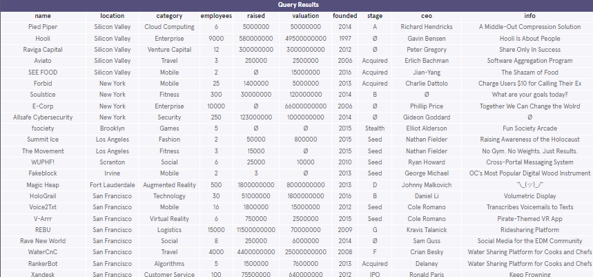

# AGGREGATE FUNCTIONS

Todo esto es tomado de **Codecademy**


**Cheatsheet**: Aggregate Functions [[link](https://www.codecademy.com/learn/paths/cscj-22-databases/tracks/cscj-22-working-with-databases/modules/wdcp-22-aggregate-functions-737d40d0-3fcf-46fe-945e-d8cb26bcc7eb/cheatsheet)]

## 1 - Introduction

Calculations performed on multiple rows of a table are called **aggregates**.

Here is a quick preview of some important aggregates:
* ```COUNT()```: count the number of rows
* ```SUM()```: the sum of the values in a column
* ```MAX()/MIN()```: the largest/smallest value
* ```AVG()```: the average of the values in a column
* ```ROUND()```: round the values in the column

**Tabla**:


**Esquema**:


## 2 - Count


The fastest way to calculate how many rows are in a table is to use the ```COUNT()``` function.

```COUNT()``` is a function that takes the name of a column as an argument and counts the number of non-empty values in that column.

```sql
SELECT COUNT(*)
FROM table_name;
```

```sql
-- 1 
SELECT COUNT(*) 
FROM fake_apps;
-- 2 (Aplicaciones gratuitas)
SELECT COUNT(*) 
FROM fake_apps
WHERE price = 0;
```

## 3 - Sum

SQL makes it easy to add all values in a particular column using ```SUM()```.

```SUM()``` is a function that takes the name of a column as an argument and returns the sum of all the values in that column.

```sql
-- 1
SELECT SUM(downloads)
FROM fake_apps;
```

## 4 - Max / Min

```sql
SELECT MAX(downloads)
FROM fake_apps;
```

```sql
-- 1
SELECT MIN(downloads)
FROM fake_apps;
-- 2
SELECT MAX(price)
FROM fake_apps;
```

## 5 - Average

SQL uses the ```AVG()``` function to quickly calculate the average value of a particular column.

```sql
SELECT AVG(downloads)
FROM fake_apps;
```

```sql
-- 1
SELECT AVG(downloads)
FROM fake_apps;
-- 2
SELECT AVG(price)
FROM fake_apps;
```

## 6 - Round

By default, SQL tries to be as precise as possible without rounding. We can make the result table easier to read using the ```ROUND()``` function.

```ROUND()``` function takes two arguments inside the parenthesis:
* a column name
* an integer

```sql
SELECT ROUND(price, 0)
FROM fake_apps;
```

```sql
-- 1
SELECT ROUND(price, 0)
FROM fake_apps;
-- 2
SELECT ROUND(AVG(price),2)
FROM fake_apps;
```

## 7 - Group By I

```sql
SELECT AVG(imdb_rating)
FROM movies
WHERE year = 1999;

SELECT AVG(imdb_rating)
FROM movies
WHERE year = 2000;

SELECT AVG(imdb_rating)
FROM movies
WHERE year = 2001;
```

We can use ```GROUP BY``` to do this in a single step:

```sql
SELECT year,
   AVG(imdb_rating)
FROM movies
GROUP BY year
ORDER BY year;
```

```GROUP BY``` is a clause in SQL that is used with aggregate functions. It is used in collaboration with the ```SELECT``` statement to arrange identical data into *groups*.

```sql
-- 1
SELECT price, COUNT(*) 
FROM fake_apps
GROUP BY price;
-- 2: count the total number of apps that have been downloaded more than 20,000 times, at each price.
SELECT price, COUNT(*) 
FROM fake_apps
WHERE downloads > 20000
GROUP BY price;
-- 3
SELECT category, SUM(downloads)
FROM fake_apps
GROUP BY category;
```

## 8 - Group By II

Sometimes, we want to ```GROUP BY``` a calculation done on a column.

For instance, we might want to know how many movies have IMDb ratings that round to 1, 2, 3, 4, 5. We could do this using the following syntax:

```sql
SELECT ROUND(imdb_rating),
   COUNT(name)
FROM movies
GROUP BY ROUND(imdb_rating)
ORDER BY ROUND(imdb_rating);
```

Lo anterior es equivalente a:

```sql
SELECT ROUND(imdb_rating),
   COUNT(name)
FROM movies
GROUP BY 1
ORDER BY 1;
```

```sql
-- 1
SELECT category, 
   price,
   AVG(downloads)
FROM fake_apps
GROUP BY category, price;
```

Lo anterior es equivalente a:

```sql
SELECT category, 
   price,
   AVG(downloads)
FROM fake_apps
GROUP BY 1, 2;
```

## 9 - Having

For instance, imagine that we want to see how many movies of different genres were produced each year, but we only care about years and genres with at least 10 movies.

```HAVING``` is very similar to ```WHERE```. In fact, all types of ```WHERE``` clauses you learned about thus far can be used with ```HAVING```.

We can use the following for the problem:

```sql
SELECT year,
   genre,
   COUNT(name)
FROM movies
GROUP BY 1, 2
HAVING COUNT(name) > 10;
```

* When we want to limit the results of a query based on values of the individual rows, use ```WHERE```.
* When we want to limit the results of a query based on an aggregate property, use ```HAVING```

```HAVING``` statement always comes after ```GROUP BY```, but before ```ORDER BY``` and ```LIMIT```.

```sql
-- 1
SELECT price, 
   ROUND(AVG(downloads)),
   COUNT(*)
FROM fake_apps
GROUP BY price
HAVING COUNT(price) > 10;
```

## 10 - Review

You just learned how to use aggregate functions to perform calculations on your data. What can we generalize so far?

* ```COUNT()```: count the number of rows
* ```SUM()```: the sum of the values in a column
* ```MAX()/MIN()```: the largest/smallest value
* ```AVG()```: the average of the values in a column
* ```ROUND()```: round the values in the column

Aggregate functions combine multiple rows together to form a single value of more meaningful information.

* ```GROUP BY``` is a clause used with aggregate functions to combine data from one or more columns.
* ```HAVING``` limit the results of a query based on an aggregate property.

## Trends in Startups

Howdy! It’s your first day as a [TechCrunch](https://techcrunch.com/) reporter. Your first task is to write an article on the rising trends in the startup world.

To get you started with your research, your boss emailed you a project.sqlite file that contains a table called ```startups```. It is a portfolio of some of the biggest names in the industry.

Write queries with aggregate functions to retrieve some interesting insights about these companies.

What are you waiting for? Let’s get started!

If you get stuck during this project or would like to see an experienced developer work through it, click "Get Unstuck" to see a project walkthrough video.




### Tasks - Write the following queries:

1. Getting started, take a look at the startups table:

   ```sql
   SELECT *
   FROM startups;
   ```
   
   How many columns are there?

2. Calculate the total number of companies in the table.

3. We want to know the total value of all companies in this table.
   
   Calculate this by getting the ```SUM()``` of the ```valuation``` column.

4. What is the highest amount raised by a startup?
   
   Return the maximum amount of money ```raised```.

5. Edit the query so that it returns the maximum amount of money ```raised```, during 'Seed' stage.
   
6. In what year was the oldest company on the list founded?

### Let's find out the valuations among different sectors:


7. Return the average ```valuation```.

8. Return the average ```valuation```, in each ```category```.

9. Return the average ```valuation```, in each ```category```.

   Round the averages to two decimal places.

10. Return the average ```valuation```, in each ```category```.

    Round the averages to two decimal places.

    Lastly, order the list from highest averages to lowest.

### What are the most competitive markets?

11. First, return the name of each ```category``` with the total number of companies that belong to it.

12. Next, filter the result to only include categories that have more than three companies in them.

    What are the most competitive markets?

### Let's see if there's a difference in startups sizes among different locations:

13. What is the average size of a startup in each ```location```?

14. What is the average size of a startup in each ```location```, with average sizes above 500?


```sql
-- 1
SELECT *
FROM startups;
-- 2
SELECT COUNT(*) 
FROM startups;
-- 3
SELECT SUM(valuation)
FROM startups;
-- 4
SELECT MAX(raised)
FROM startups;
-- 5
SELECT MAX(raised)
FROM startups
WHERE stage = 'Seed';
-- 6
SELECT MIN(founded)
FROM startups;
-- 7
SELECT AVG(valuation)
FROM startups;
-- 8
SELECT category, AVG(valuation)
FROM startups
GROUP BY category;
-- 9
SELECT category, ROUND(AVG(valuation),2)
FROM startups
GROUP BY category;
-- 10
SELECT category, ROUND(AVG(valuation),2)
FROM startups
GROUP BY 1
ORDER BY 2 DESC;
-- 11
SELECT category, COUNT(*)
FROM startups
GROUP BY category;
-- 12a
SELECT category, COUNT(*)
FROM startups
GROUP BY category
HAVING COUNT(*) > 3;
-- 12b
SELECT category, COUNT(*)
FROM startups
GROUP BY category
HAVING COUNT(*) > 3
ORDER BY 2 DESC;
-- 13
SELECT location, AVG(employees)
FROM startups
GROUP BY location;
-- 14
SELECT location, AVG(employees)
FROM startups
GROUP BY location
HAVING AVG(employees) > 500;    
```

**Solución**: [link](https://gist.github.com/codecademydev/2726be8626a3e487980374be214268e1)

## Analyze Hacker News Trends


[Hacker News](https://news.ycombinator.com/) is a popular website run by Y Combinator. It’s widely known by people in the tech industry as a community site for sharing news, showing off projects, asking questions, among other things.

In this project, you will be working with a table named hacker_news that contains stories from Hacker News since its launch in 2007. It has the following columns:
* ```title```: the title of the story
* ```user```: the user who submitted the story
* ```score```: the score of the story
* ```timestamp```: the time of the story
* ```url```: the link of the story

This data was kindly made publicly available under the [MIT license](https://opensource.org/license/mit/).

Let’s get started!

### Tasks

#### Understanding the dataset

1. Start by getting a feel for the hacker_news table!

   Let’s find the most popular Hacker News stories:
   
   ```sql
   SELECT title, score
   FROM hacker_news
   ORDER BY score DESC
   LIMIT 5;
   ```
    
   What are the top five stories with the highest scores?

#### Hacker News Moderating

2. Recent studies have found that online forums tend to be dominated by a small percentage of their users ([1-9-90 Rule](https://en.wikipedia.org/wiki/1%25_rule)).
   
   *Is this true of Hacker News?*
   
   *Is a small percentage of Hacker News submitters taking the majority of the points?*
   
   First, find the total ```score``` of all the stories.

3. Next, we need to pinpoint the users who have accumulated a lot of points across their stories.
   
   Find the individual users who have gotten combined ```score```s of more than 200, and their combined ```score```s.
   
   ```GROUP BY``` and ```HAVING``` are needed!

4. Then, we want to add these users’ ```score```s together and divide by the total to get the percentage.
   
   Add their scores together and divide it by the total sum. Like so:

   ```sql
   SELECT (1.0 + 2.0 + 3.0) / 6.0;
   ```

   So, is Hacker News dominated by these users?

5. Oh no! While we are looking at the power users, some users are [rickrolling](https://knowyourmeme.com/memes/rickroll) — tricking readers into clicking on a link to a funny [video](https://www.youtube.com/watch?v=dQw4w9WgXcQ) and claiming that it links to information about coding.

   The ```url``` of the video is:
   
   ```https://www.youtube.com/watch?v=dQw4w9WgXcQ```

   *How many times has each offending user posted this link?*

#### Which sites feed Hacker News?

6. Hacker News stories are essentially links that take users to other websites.
   
   Which of these sites feed Hacker News the most:
   
   [GitHub](https://github.com/), [Medium](https://medium.com/), or [New York Times](https://www.nytimes.com/)?
   
   First, we want to categorize each story based on their source.
   
   We can do this using a ```CASE``` statement:

   ```sql
   SELECT CASE
      WHEN url LIKE '%github.com%' THEN 'GitHub'
      -- WHEN statement here
      -- WHEN statement here
      -- ELSE statement here
      END AS 'Source'
   FROM hacker_news;
   ```
  
   Fill in the other ```WHEN``` statements and the ```ELSE``` statement.

7. Next, build on the previous query:
   
   Add a column for the number of stories from each URL using ```COUNT()```.

   Also, ```GROUP BY``` the ```CASE``` statement.

   Remember that you can refer to a column in ```GROUP BY``` using a number.

#### What's the best time to post a story?

8. Every submitter wants their story to get a high score so that the story makes it to the front page, but...
   
   *What’s the best time of the day to post a story on Hacker News?*
   
   Before we get started, let’s run this query and take a look at the ```timestamp``` column:
   
   ```sql
   SELECT timestamp
   FROM hacker_news
   LIMIT 10;
   ```
   
   Notice that the values are formatted like:

   ```2018-05-08T12:30:00Z```

   If you ignore the ```T``` and ```Z```, the format is:

   ```YYYY-MM-DD HH:MM:SS```

9. SQLite comes with a ```strftime()``` function - a very powerful function that allows you to return a formatted date.
    
    It takes two arguments:
    
    ```strftime(format, column)```

    Let’s test this function out:

    ```sql
    SELECT timestamp,
       strftime('%H', timestamp)
    FROM hacker_news
    GROUP BY 1
    LIMIT 20;
    ```

    What do you think this does? Open the hint if you’d like to learn more.

10. Okay, now we understand how ```strftime()``` works.
    Let’s write a query that returns three columns:
    1. The hours of the ```timestamp```
    2. The average ```score``` for each hour
    3. The count of stories for each hour

11. Let’s edit a few things in the previous query:
    * Round the average ```score```s (```ROUND()```).
    * Rename the columns to make it more readable (```AS```).
    * Add a ```WHERE``` clause to filter out the ```NULL``` values in ```timestamp```.

    Take a look at the result again:
    
    What are the best hours to post a story on Hacker News?

You made it past the finish line! If you're done, be sure to check off all the tasks for this project.

### Solucion

```sql
-- 1 
SELECT title, score
FROM hacker_news
ORDER BY score DESC
LIMIT 5;
```


```sql
-- 2 
SELECT SUM(score) AS TotalScore
FROM hacker_news;

-- 3
SELECT user,SUM(score) AS TotalScore
FROM hacker_news
GROUP BY user 
HAVING SUM(score) > 200
ORDER BY score DESC;

-- 4
SELECT (517 + 309 + 304 + 282) / 6366.0;

-- 5a
SELECT user,
   COUNT(*)
FROM hacker_news
WHERE url LIKE '%watch?v=dQw4w9WgXcQ%'
GROUP BY user
ORDER BY COUNT(*) DESC;

-- 5b
SELECT user,
   COUNT(*)
FROM hacker_news
WHERE url LIKE '%watch?v=dQw4w9WgXcQ%'
GROUP BY 1
ORDER BY 2 DESC;

-- 6
SELECT CASE
   WHEN url LIKE '%github.com%' THEN 'GitHub'
   WHEN url LIKE '%medium.com%' THEN 'Medium'
   WHEN url LIKE '%nytimes.com%' THEN 'New York Times'
   ELSE 'Other'
  END AS 'Source'
FROM hacker_news;

-- 7
SELECT CASE
   WHEN url LIKE '%github.com%' THEN 'GitHub'
   WHEN url LIKE '%medium.com%' THEN 'Medium'
   WHEN url LIKE '%nytimes.com%' THEN 'New York Times'
   ELSE 'Other'
  END AS 'Source', 
  COUNT(*)
FROM hacker_news
GROUP BY 1;
```


