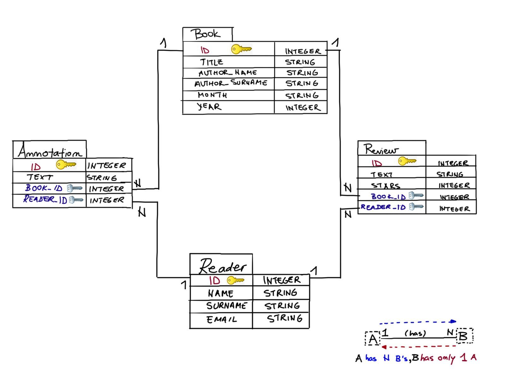
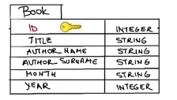
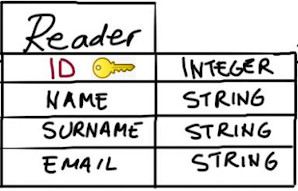

# SQLite + Flask

> **Nota**: Todos estos estan tomados de Codeacademy

De [SQLite Data Starter Packs](http://2016.padjo.org/tutorials/sqlite-data-starterpacks/) se descarga [American Community Survey 1-Year Data for 2015](http://2016.padjo.org/tutorials/sqlite-data-starterpacks/#toc-american-community-survey-1-year-data-for-2015)

```
sqlite3 .\acs-1-year-2015.sqlite
```

```sql
.databases

.schema

SELECT * FROM states;

SELECT name, per_capita_income
FROM states
ORDER BY per_capita_income ASC;

SELECT name, median_age
FROM states
ORDER BY median_age ASC;
```

Ahora vamos a instalar el https://sqlitebrowser.org/, este, cuando se instala por default queda en ```C:\Program Files\DB Browser for SQLite```

DB Browser and used it to perform SQL tasks visually. You can now use DB Browser to visualize what SQL commands will accomplish without worrying about affecting the state of your database. Verify these commands do what you want, and press “Write Changes” to commit to them. 


# Introduction to Flask-SQLAlchemy

## 1- Why have databases in your web applications?

Web applications are often built around a lot of data that change frequently. The data is usually organized in entities related in some way.

*Relational databases* offer robust and efficient data management. A usual relational database consists of tables that represent entities and/or relationships amongst entities. The attributes of entities are constrained (for example, NAME attribute is a string, and a user’s PASSWORD should not be empty). The way a database is organized in entities, attributes and relationships, without data being present, is called the database schema.

### Database schema design: A simple book club scenario

You want to create a personal book club application. Each month you pick a book your friends can review and rate. Your web app manages registered readers, the list of books you choose each month, and the ratings the readers write for those books. Moreover, you can show the annotations your friends made while reading the suggested books.

The schema for this problem is shown on the right. Inspect the schema by following the instructions below.



**Entities** in our database are Reader, Book, Review and Annotation. Those represent tables in the schema.

**Attributes** are properties of an entity and are represented as columns in a database table. For example, Reader’s attributes are NAME, SURNAME and EMAIL, and Review’s attributes are TEXT and STARS (representing ratings from 1 to 5).

**Relationships** are represented as arrows between tables. Readers are in a relationship with books by reviewing them and by making annotations. A reader can review and annotate multiple books. A book can have multiple reviews and annotations. Each review or annotation is associated with one book and one reader. We say that Reader is in a one-to-many relationship with Review, and Annotation. Similarly, Book is in a one-to-many relationship with Review and Annotation.

Columns with the yellow key represent the primary key columns that uniquely identify entries in the table.

Columns with the silver key symbols represent the foreign key columns that represent references to the primary keys of other tables.

Note: often when modeling application databases, nouns represent entities (readers and books) and verbs represent relationships (to review).

## 2 - Flask application with Flask-SQLAlchemy

To start creating a minimal application

1. Import SQLAlchemy class from the flask_sqlalchemy

```python
from flask import Flask
from flask_sqlalchemy import SQLAlchemy
```

2. to create our Flask app instance
   
```python
app = Flask(__name__)
```

3. To enable communication with a database, the Flask-SQLAlchemy extension takes the location of the application’s database from the SQLALCHEMY_DATABASE_URI
   
```python
app.config['SQLALCHEMY_DATABASE_URI'] = 'sqlite:///myDB.db' 
```

4. we set the SQLALCHEMY_TRACK_MODIFICATIONS configuration option to False to disable a feature of Flask-SQLAlchemy that signals the application every time a change is about to be made in the database.

```python
app.config['SQLALCHEMY_TRACK_MODIFICATIONS'] = False
```
5. Finally, we create an SQLAlchemy object and bind it to our app:
   
```python
db = SQLAlchemy(app)
```

## 3 - Declaring a simple model: Book

The database object ```db``` created in our application contains all the functions and helpers from both SQLAlchemy and SQLAlchemy Object Relational Mapper ([ORM](https://www.educative.io/answers/what-is-object-relational-mapping)). SQLAlchemy ORM associates user-defined Python classes with database tables, and instances of those classes (objects) with rows in their corresponding tables. The classes that mirror the database tables are referred to as *models*.

We would like to create a Flask-SQLAlchemy ORM representation of the following table schema:



```Model``` represents a declarative base in SQLAlchemy which can be used to declare models. For ```Book``` to be a database model for the database instance ```db```, it has to inherit from ```db.Model``` in the following way:

```python
class Book(db.Model):
```

**Codigo**: [link](https://gist.github.com/codecademydev/8bbc233c46c59c8f37fadab98755ea62)


## 4 - Declaring a simple model: Reader



## Referencias

* http://2016.padjo.org/tutorials/sqlite-data-starterpacks/
* https://www.reddit.com/r/SQL/comments/16s76l5/beginner_struggling_to_open_a_sqlite_data_starter/
* https://web.stanford.edu/class/cs102/dataconversion.htm
* https://sqlitebrowser.org/