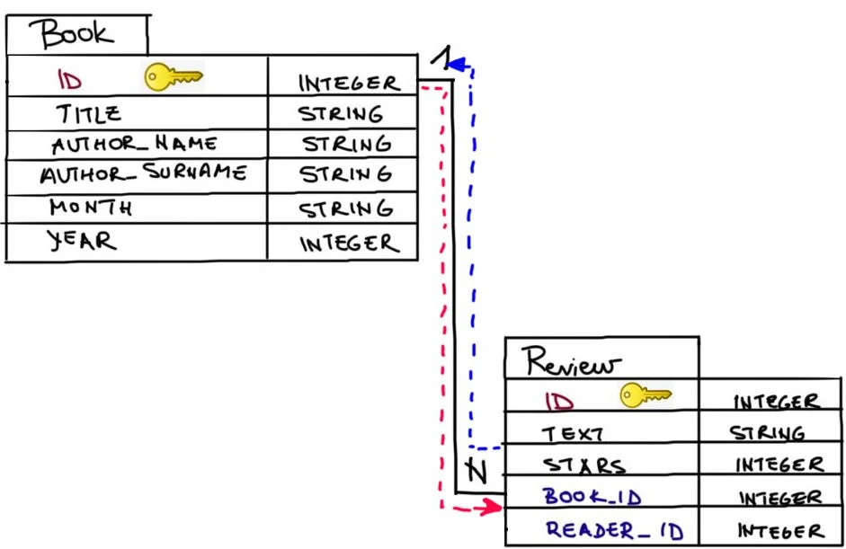
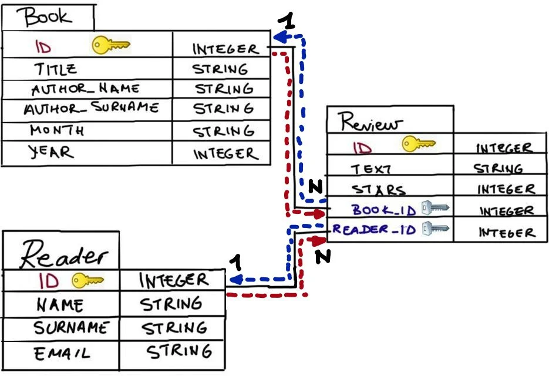

# SQLite + Flask

> **Nota**: Todos estos estan tomados de Codeacademy

De [SQLite Data Starter Packs](http://2016.padjo.org/tutorials/sqlite-data-starterpacks/) se descarga [American Community Survey 1-Year Data for 2015](http://2016.padjo.org/tutorials/sqlite-data-starterpacks/#toc-american-community-survey-1-year-data-for-2015)

```
sqlite3 .\acs-1-year-2015.sqlite
```

```sql
.databases

.schema

SELECT * FROM states;

SELECT name, per_capita_income
FROM states
ORDER BY per_capita_income ASC;

SELECT name, median_age
FROM states
ORDER BY median_age ASC;
```

Ahora vamos a instalar el https://sqlitebrowser.org/, este, cuando se instala por default queda en ```C:\Program Files\DB Browser for SQLite```

DB Browser and used it to perform SQL tasks visually. You can now use DB Browser to visualize what SQL commands will accomplish without worrying about affecting the state of your database. Verify these commands do what you want, and press “Write Changes” to commit to them. 


# Introduction to Flask-SQLAlchemy

## 1- Why have databases in your web applications?

Web applications are often built around a lot of data that change frequently. The data is usually organized in entities related in some way.

*Relational databases* offer robust and efficient data management. A usual relational database consists of tables that represent entities and/or relationships amongst entities. The attributes of entities are constrained (for example, NAME attribute is a string, and a user’s PASSWORD should not be empty). The way a database is organized in entities, attributes and relationships, without data being present, is called the database schema.

### Database schema design: A simple book club scenario

You want to create a personal book club application. Each month you pick a book your friends can review and rate. Your web app manages registered readers, the list of books you choose each month, and the ratings the readers write for those books. Moreover, you can show the annotations your friends made while reading the suggested books.

The schema for this problem is shown on the right. Inspect the schema by following the instructions below.


**Entities** in our database are Reader, Book, Review and Annotation. Those represent tables in the schema.

**Attributes** are properties of an entity and are represented as columns in a database table. For example, Reader’s attributes are NAME, SURNAME and EMAIL, and Review’s attributes are TEXT and STARS (representing ratings from 1 to 5).

**Relationships** are represented as arrows between tables. Readers are in a relationship with books by reviewing them and by making annotations. A reader can review and annotate multiple books. A book can have multiple reviews and annotations. Each review or annotation is associated with one book and one reader. We say that Reader is in a one-to-many relationship with Review, and Annotation. Similarly, Book is in a one-to-many relationship with Review and Annotation.

Columns with the yellow key represent the primary key columns that uniquely identify entries in the table.

Columns with the silver key symbols represent the foreign key columns that represent references to the primary keys of other tables.

Note: often when modeling application databases, nouns represent entities (readers and books) and verbs represent relationships (to review).

## 2 - Flask application with Flask-SQLAlchemy

To start creating a minimal application

1. Import SQLAlchemy class from the flask_sqlalchemy

```python
from flask import Flask
from flask_sqlalchemy import SQLAlchemy
```

2. to create our Flask app instance
   
```python
app = Flask(__name__)
```

3. To enable communication with a database, the Flask-SQLAlchemy extension takes the location of the application’s database from the SQLALCHEMY_DATABASE_URI
   
```python
app.config['SQLALCHEMY_DATABASE_URI'] = 'sqlite:///myDB.db' 
```

4. we set the SQLALCHEMY_TRACK_MODIFICATIONS configuration option to False to disable a feature of Flask-SQLAlchemy that signals the application every time a change is about to be made in the database.

```python
app.config['SQLALCHEMY_TRACK_MODIFICATIONS'] = False
```
5. Finally, we create an SQLAlchemy object and bind it to our app:
   
```python
db = SQLAlchemy(app)
```

## 3 - Declaring a simple model: Book

The database object ```db``` created in our application contains all the functions and helpers from both SQLAlchemy and SQLAlchemy Object Relational Mapper ([ORM](https://www.educative.io/answers/what-is-object-relational-mapping)). SQLAlchemy ORM associates user-defined Python classes with database tables, and instances of those classes (objects) with rows in their corresponding tables. The classes that mirror the database tables are referred to as *models*.

We would like to create a Flask-SQLAlchemy ORM representation of the following table schema:


```Model``` represents a declarative base in SQLAlchemy which can be used to declare models. For ```Book``` to be a database model for the database instance ```db```, it has to inherit from ```db.Model``` in the following way:

```python
class Book(db.Model):
```

**Codigo**: [link](https://gist.github.com/codecademydev/8bbc233c46c59c8f37fadab98755ea62)


```python
#declaring the Book model
class Book(db.Model):
    id = db.Column(db.Integer, primary_key = True) #primary key column
    title = db.Column(db.String(80), index = True, unique = True) # book title
    author_name = db.Column(db.String(50), index = True, unique = False) #author name
    author_surname = db.Column(db.String(80), index = True, unique = False) #author surname
    month = db.Column(db.String(20), index = True, unique = False) #the month of the book suggestion
    year = db.Column(db.Integer, index = True, unique = False) #tthe year of the book suggestion
    
    #Get a nice printout for Book objects
    def __repr__(self):
        return "{} in: {},{}".format(self.title, self.month,self.year)
```

## 4 - Declaring a simple model: Reader

To make it easier for you, here’s the schema representation of ```Reader```:


```python
#Add your columns for the Reader model here below.
class Reader(db.Model):
  id = db.Column(db.Integer, primary_key = True)
  #insert your code here
  name = db.Column(db.String(50), index = True, unique = False)
  surname = db.Column(db.String(80), index = True, unique = False)  
  email = db.Column(db.String(120), index = True, unique = True)  
  #get a nice printout for Reader objects
  def __repr__(self):
      return "Reader: {}".format(self.email)
```

## 5 - Part I: declaring relationships (one-to-many)

Often times in real-world applications we will have entities that are somehow related. Students take courses, customers buy products, and users comment on posts.

In SQLAlchemy we can declare a relationship with a field initialized with the ```.relationship()``` method. In one-to-many relationships, the ```relationship``` field is used on the 'one' side of the relationship. In our use case we have the following one-to-many relationships:
1. One book ———< many reviews for that book
2. One reader ——–< many reviews from that reader

Hence, we add relationship fields to the ```Book``` and ```Reader``` models.

We declare a one-to-many relationship between ```Book``` and ```Review``` by creating the following field in the ```Book``` model:

```python
reviews = db.relationship('Review', backref='book', lazy='dynamic')
```

where:
* the first argument denotes which model is to be on the 'many' side of the relationship: ```Review```.
* ```backref = 'book'``` establishes a ```book``` attribute in the related class (in our case, class Review) which will serve to refer back to the related ```Book``` object. *```lazy = dynamic``` makes related objects load as SQLAlchemy’s query objects.

By adding ```relationship``` to ```Book``` we only handled one side in our one-to-many relationship. Specifically, we only covered the direction denoted by the red arrow in the schema below:



We will add the Review model and its relationship with the Book model (the blue arrow).

```python
reviews = db.relationship('Review', backref='reviewer', lazy='dynamic') 
```

## 6 - Part II: declaring relationships (Foreign keys)

We additionally have to specify what the foreign keys are for the model on the 'many' side of the relationship. To remind you, a foreign key is a field (or collection of fields) in one table that refers to the primary key in another table.

In this exercise we want to create the following database schema:



To complete the schema, we need to add the ```Review``` model, and specify the foreign keys (blue arrows) representing the following relationship:
* One review ——– one book for which the review was written
* One review ——– one reader who wrote that review

The red arrows were covered in the previous exercise with the ```db.relationship()``` columns.


```python
#relationship of Books and Reviews
reviews = db.relationship('Review', backref = 'book', lazy = 'dynamic') 
#relationship of Reader and Reviews
reviews = db.relationship('Review', backref='reviewer', lazy='dynamic') 
```

the ```Review``` model has its own columns such as ```text```, ```stars``` (denoting ratings), and its own primary key field ```id```. Review additionally needs to specify which other models it is related to by specifying their primary key in its foreign key column:

```python
#declaring the Review model
class Review(db.Model):
    id = db.Column(db.Integer, primary_key = True) #primary key column, automatically generated IDs
    stars = db.Column(db.Integer, unique = False) #a review's rating
    text = db.Column(db.String(200), unique = False) #a review's text
    #here below is the foreign key column linking to the primary key (id) of the Book model (book). 
    #Note the lower case here: 'book.id' instead of 'Book.id'
    book_id = db.Column(db.Integer, db.ForeignKey('book.id')) #foreign key column
    ...
```

```python
    #Note the lower case here: 'book.id' instead of 'Book.id'
    book_id = db.Column(db.Integer, db.ForeignKey('book.id')) #foreign key column
```

The ```book_id``` field is a foreign key that refers to the primary key ```id``` of the ```Book``` table. Similar to the primary key, a foreign key is just another column in our model with unique entries.

Al final tenemos:

```python
#declaring the Review model
class Review(db.Model):
    id = db.Column(db.Integer, primary_key = True) #primary key column, automatically generated IDs
    stars = db.Column(db.Integer, unique = False) #a review's rating
    text = db.Column(db.String(200), unique = False) #a review's text
    #here below is the foreign key column linking to the primary key (id) of the Book model (book). 
    #Note the lower case here: 'book.id' instead of 'Book.id'
    book_id = db.Column(db.Integer, db.ForeignKey('book.id')) #foreign key column
    #Checkpoint 1: your code here below (be careful about the indentation)
    reviewer_id = db.Column(db.Integer, db.ForeignKey('reader.id')) #foreign key column
    #get a nice printout for Review objects
    def __repr__(self):
        return "Review: {} stars: {}".format(self.text, self.stars)
```

## 7 - Putting it all together: initializing the database

When you ran your application in the previous exercises you might have realized that there is no database file created in the application folder. The reason is simple: we need to explicitly initialize the database according to the models declared.

We can initialize our database in two ways:

1. Using the interactive Python shell.
   
   ```
   python3
   ```

   ```
   >>> from app import db
   >>> db.create_all()
   >>> db
   <SQLAlchemy engine=sqlite:////home/ccuser/workspace/flask-intro-sql-alchemy-initializing-database/myDB.db>
   ```

## 8 - Creating database entries: entities

Now that we initialized our database schema, the next step is to start creating entries that will later populate the database. The beauty of SQLAlchemy Object Relational Mapper (ORM) is that our database entries are simply created as instances of Python classes representing the declared models.

```python
#This is a separate Python script in which we practice creating database objects
#You can also perform these operations in command-line terminal
from app import Reader, Book, Review

b1 = Book(id = 123, title = 'Demian', author_name = "Hermann", author_surname = 'Hesse', month = "February", year = 2020)
r1 = Reader(id = 342, name = 'Ann', surname = 'Adams', email = 'ann.adams@example.com')

print("My first reader:", r1.name)

#Checkpoint 1: 
b2 = Book(id = 533, title = 'The Stranger', author_name = "Albert", author_surname = 'Camus', month = "April", year = 2019)
#Checkpoint 2: 
r2 = Reader(id = 765, name = 'Sam', surname = 'Adams', email = 'sam.adams@example.com')
#Checkpoint 3: 
print(b2.author_surname)
#Checkpoint 4:
print(len(r2.email))
```

## 9 - Creating database entries: relationships

Creating objects for tables that have foreign keys is not much different from the usual creation of Python objects.

```python
b1 = Book(id = 123, title = 'Demian', author_name = 'Hermann', author_surname = 'Hesse')
b2 = Book(id = 533, title = 'The stranger', author_name = 'Albert', author_surname = 'Camus')
r1 = Reader(id = 342, name = 'Ann', surname = 'Adams', email = 'ann.adams@example.com')
r2 = Reader(id = 312, name = 'Sam', surname = 'Adams', email = 'sam.adams@example.com')
```

To create an entry in the ```Review``` table, in addition to specifying a review text and a rating, we also need to specify which reader wrote the review, and for which book. In other words, we need to specify values for the review’s foreign keys ```reviewer_id``` and ```book_id``` that represent primary keys in ```Reader``` and ```Book```, respectively.

```python
rev1 = Review(id = 435, text = 'This book is amazing...', stars = 5, reviewer_id = r1.id, book_id = b1.id)
```

Luego:

```python
#This is a separate Python script in which we practice creating database objects
#You can also perform these operations in command-line terminal
from app import Reader, Book, Review

b1 = Book(id = 123, title = 'Demian', author_name = 'Hermann', author_surname = 'Hesse')
b2 = Book(id = 533, title = 'The stranger', author_name = 'Albert', author_surname = 'Camus')
r1 = Reader(id = 342, name = 'Ann', surname = 'Adams', email = 'ann.adams@example.com')
r2 = Reader(id = 312, name = 'Sam', surname = 'Adams', email = 'sam.adams@example.com')

rev1 = Review(id = 435, text = 'This book is amazing...', stars = 5, reviewer_id = r1.id, book_id = b1.id)
print(rev1) #prints the rev1 object
print(rev1.text) #prints the text of the review rev1
print(rev1.book_id) #prints the id of the book for which the review was written

#Checkpoint 1: 
rev2 = Review(id = 450, text = 'This book is difficult!', stars = 2, reviewer_id = r2.id, book_id = b2.id)

#Checkpoint 2:
print(len(rev2.text.split())) 
```

## 10 - Review

In this lesson, you have learned how to:
* import Flask-SQLAlchemy and configure your app to support database connections.
* create your first model representing a table schema using Flask-SQLAlchemy ORM by declaring classes that extend ```Model```
* specify attributes of database entities by using ```Column``` fields
* set the primary key ```Column```
* create a one-to-many relationship by using ```relationship()```
* specify foreign key columns
* initialize the database according to the declared models by using ```create_all()```
* create database entries as instances of the declared Flask-SQLAlchemy classes

We added the ```Annotation``` model to the ```app.py``` file in order to complete our database schema shown in the first exercise of this lesson. Moreover, we demonstrate for you in the browser how to combine the templates and database queries to list all the books we already put in the database for you. In the next lesson, you will learn how to accomplish this yourself! Excited? Let’s go.

## Referencias

* http://2016.padjo.org/tutorials/sqlite-data-starterpacks/
* https://www.reddit.com/r/SQL/comments/16s76l5/beginner_struggling_to_open_a_sqlite_data_starter/
* https://web.stanford.edu/class/cs102/dataconversion.htm
* https://sqlitebrowser.org/