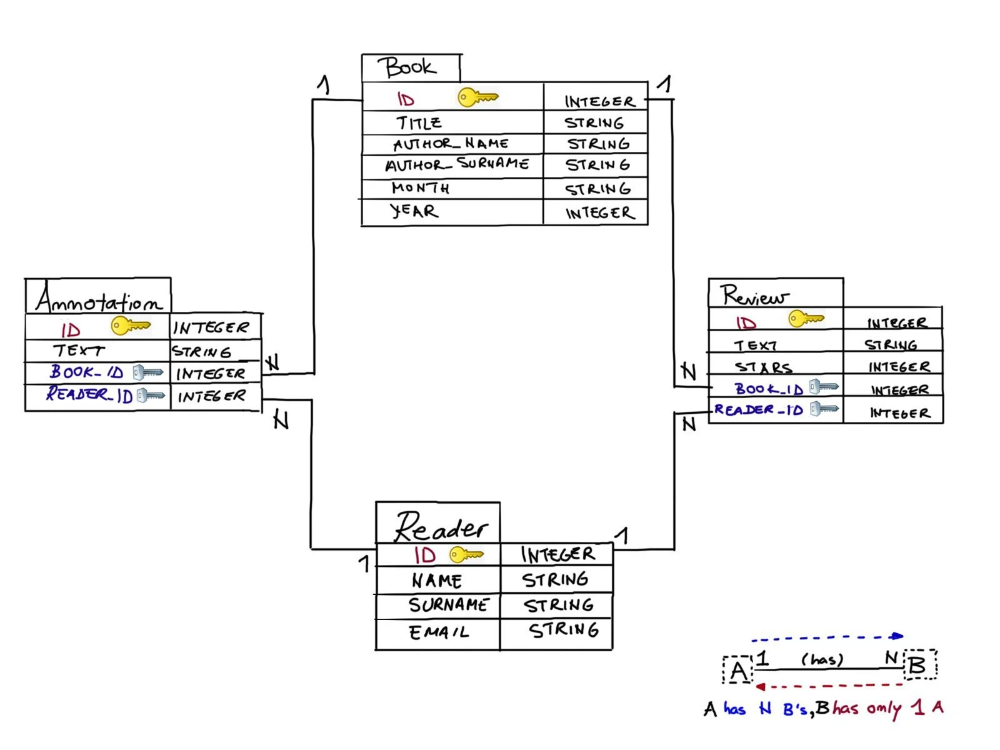

# Interacting with a Database

Your database has a number of readers who subscribed to your book club and some books you already assigned to be read. Also some of your readers wrote reviews about the books and some of them might have some annotations made while reading their books on an eReader. The schema representing the database is in the image on the right.



**What can you do with the database?**

These are all the most common interactions with a database:
*  list all the books you suggested.
*  list all the subscribed readers.
*  let each subscriber see only the reviews they wrote.
*  When new people subscribe to your web service, you need to add them to your database, or when they unsubscribe delete them.
*  If you made a mistake in changing your database, you probably want to undo the changes or ‘rollback’ to the previous correct state. 
*  When your subscribers change their e-mail, you need to update your database.
*  you need to filter out the books your club read in the year 2019 and only calculate average ratings of those.

## 2 - Queries: query.all() and query.get()

Querying a database table with Flask SQLAlchemy is done through the ```query``` property of the ```Model``` class. To get all entries from a model called ```TableName``` we run ```TableName.query.all()```. Often you know the primary key (unique identifier) value of entries you want to fetch. To get an entry with some primary key value ```ID``` from model ```TableName``` you run: ```TableName.query.get(ID)```

```python
readers = Reader.query.all()
```

```python
reader = Reader.query.get(123)
```

```python
reader = Reader.query.get(450)
print(reader.name)
```

```python
readers = Reader.query.all()
for reader in readers: 
    print(reader.name)
```

```python
from app import db, Book, Reader, Review, Annotation

#query all the readers from the Reader model
readers = Reader.query.all()
print(readers)

#get an entry with id = 123 
reader = Reader.query.get(123)
print(reader)

#reader with id = 450
reader = Reader.query.get(450)
print("Reader with id = ", reader.id, "is called", reader.name)

#Loop through all the readers and print their e-mails
print("\nPrint all the readers in a loop:")
for reader in readers:
  print(reader.email)

#or inline
#[print(reader.email) for reader in readers]
reviews = Review.query.all()
#reviews = 

print("\nCheckpoint2: looping through all the reviews and printing their text")
#your loop line 1
#you loop line 2
for review in reviews: 
    print(review.text)

print("\nCheckpoint1: fetching all the reviews")

print("\nCheckpoint3: fetching a book with id = 13 using the get() function")
#book_1 = 
book_1 = Book.query.get(12)
```

## 3 - Queries: retrieve related objects

The models we declared contain relationships. Readers write multiple reviews and have multiple annotations. Similarly, books have multiple reviews and multiple annotations. 

### Fetching many objects

We fetch related objects of some object by accessing its attribute defined with ```.relationship()```.

```python
reader = Reader.query.get(123)
reviews_123 = reader.reviews.all()
# Forma encadenada
reviews_123 = Reader.query.get(123).reviews.all()
```

### Fetching one object

For ```Review``` object we can fetch its authoring ```Reader``` through the ```backref``` field specified in ```Reader```'s ```.relationship()``` attribute. 

```python
review = Review.query.get(111)
reviewer_111 = review.reviewer 
# Forma encadenada
reviewer_111 = Review.query.get(111).reviewer
```


