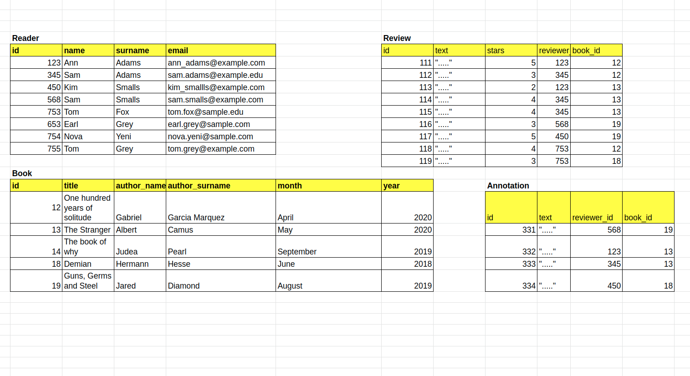

# Interacting with a Database

Your database has a number of readers who subscribed to your book club and some books you already assigned to be read. Also some of your readers wrote reviews about the books and some of them might have some annotations made while reading their books on an eReader. The schema representing the database is in the image on the right.


**What can you do with the database?**

These are all the most common interactions with a database:
*  list all the books you suggested.
*  list all the subscribed readers.
*  let each subscriber see only the reviews they wrote.
*  When new people subscribe to your web service, you need to add them to your database, or when they unsubscribe delete them.
*  If you made a mistake in changing your database, you probably want to undo the changes or ‘rollback’ to the previous correct state. 
*  When your subscribers change their e-mail, you need to update your database.
*  you need to filter out the books your club read in the year 2019 and only calculate average ratings of those.



## 2 - Queries: query.all() and query.get()

Querying a database table with Flask SQLAlchemy is done through the ```query``` property of the ```Model``` class. To get all entries from a model called ```TableName``` we run ```TableName.query.all()```. Often you know the primary key (unique identifier) value of entries you want to fetch. To get an entry with some primary key value ```ID``` from model ```TableName``` you run: ```TableName.query.get(ID)```

```python
readers = Reader.query.all()
```

```python
reader = Reader.query.get(123)
```

```python
reader = Reader.query.get(450)
print(reader.name)
```

```python
readers = Reader.query.all()
for reader in readers: 
    print(reader.name)
```

```python
from app import db, Book, Reader, Review, Annotation

#query all the readers from the Reader model
readers = Reader.query.all()
print(readers)

#get an entry with id = 123 
reader = Reader.query.get(123)
print(reader)

#reader with id = 450
reader = Reader.query.get(450)
print("Reader with id = ", reader.id, "is called", reader.name)

#Loop through all the readers and print their e-mails
print("\nPrint all the readers in a loop:")
for reader in readers:
  print(reader.email)

#or inline
#[print(reader.email) for reader in readers]
reviews = Review.query.all()
#reviews = 

print("\nCheckpoint2: looping through all the reviews and printing their text")
#your loop line 1
#you loop line 2
for review in reviews: 
    print(review.text)

print("\nCheckpoint1: fetching all the reviews")

print("\nCheckpoint3: fetching a book with id = 13 using the get() function")
#book_1 = 
book_1 = Book.query.get(12)
```

## 3 - Queries: retrieve related objects

The models we declared contain relationships. Readers write multiple reviews and have multiple annotations. Similarly, books have multiple reviews and multiple annotations. 

### Fetching many objects

We fetch related objects of some object by accessing its attribute defined with ```.relationship()```.

```python
reader = Reader.query.get(123)
reviews_123 = reader.reviews.all()
# Forma encadenada
reviews_123 = Reader.query.get(123).reviews.all()
```

### Fetching one object

For ```Review``` object we can fetch its authoring ```Reader``` through the ```backref``` field specified in ```Reader```'s ```.relationship()``` attribute. 

```python
review = Review.query.get(111)
reviewer_111 = review.reviewer 
# Forma encadenada
reviewer_111 = Review.query.get(111).reviewer
```


```python
from app import db, Book, Reader, Review, Annotation

#Fetching 'many' objects
reader = Reader.query.get(123) #fetch a reader with id = 123
reviews_123 = reader.reviews.all() #fetch all reviews made by reader wiith id = 123
[print(review.id) for review in reviews_123]
#check the image on the right - Ann Adams (id = 123, wrote reviews with ids 111 and 113)

#fetching 'one' object
review = Review.query.get(111) #fetch a review with id = 111
reviewer_111 = review.reviewer #get the reviewer for review with id = 111. There's only one!
print("The author of [", review, "] is", reviewer_111)

#By chaining we avoid using temporary variables
reviews_123 = Reader.query.get(123).reviews.all() #same result as line 5
reviewer_111 = Review.query.get(111).reviewer #same result as line 10

print("\nCheckpoint 1: fetch all the reviews made for a book with id = 13.")
#book_13 = 
book_13 = Book.query.get(13).reviews.all()
[print(book.id) for book in book_13]

print("\nCheckpoint 2: fetch all the annotations made for a book with id = 19.")
#book_19_an = 
book_19_an =  Book.query.get(19).annotations.all()
[print(annotation.id) for annotation in book_19_an]

print("\nCheckpoint 3: fetch the reader who owns the annotation with `id = 331.`")
#author_331 = 
author_331 = Annotation.query.get(331).author
print(author_331)
```

## 4 - Queries: filtering

Often times you don’t want to retrieve all the entries from a table but select only those that satisfy some criterion. Criteria are usually based on the values of the table’s columns. To filter a query, SQLAlchemy provides the ```.filter()``` method.

```python
Book.query.filter(Book.year == 2020).all()
```

This can be done by using several additional methods like 
* ```.all()``` that returns a list of all results
* ```.count()``` that counts the number of fetched entries
* ```.first()``` that returns only one result, namely the first one.

```python
Book.query.filter(Book.year == 2020).first()
```

```python
Review.query.filter(Review.stars <= 3, Review.book_id == 1).all()
```

**Note**: there is also the ```.filter_by()``` method that uses only a simple attribute-value test for filtering.

### Ejercicio

```python
from app import Book, Reader, Review, Annotation

#select books from the year 2020
book_2020 = Book.query.filter(Book.year == 2020).all()
print("All the suggested books in the year 2020:")
[print(book) for book in book_2020]

#instead of all books suggested in 2020, fetch only the first one
book_2020_first = Book.query.filter(Book.year == 2020).first()
print("\nThe first book fetched from the year 2020: ", book_2020_first)

#you can specify multiple criteria for filtering
rev_3_boook13 = Review.query.filter(Review.stars <= 3, Review.book_id == 13).all()
print("\nThe review of 3 stars or lower written for a book with id = 13: ", rev_3_boook13)

#Checkpoint 1: fetching all the readers with "Adams" surname
#adams = 
#[print(person) for person in adams]
adams = Reader.query.filter(Reader.surname == 'Adams').all()
[print(person) for person in adams]

#Checkpoint 2: fetching the first book dating prior to the year 2019
#book_pre2019 = 
#print(book_pre2019)
book_pre2019 = Book.query.filter(Book.year <= 2019).first()
print(book_pre2019)
```

## 5 - Queries: more advanced filtering

Flask-SQLALchemy allows more complex queries and operations such as checking whether a column starts, or ends, with some string. One can also order retrieved queries by some criterion. There are many more possible queries, but here we cover only some of them.

```python
education = Reader.query.filter(Reader.email.endswith('edu')).all()
```

```python
emails = Reader.query.filter(Reader.email.like('%.%@%')).all()
```

```python
ordered_books = Book.query.order_by(Book.year).all()
```

[SQLAlchemy Core + ORM documentation](https://docs.sqlalchemy.org/en/20/core/)

### Ejercicio

```python
from app import db, Book, Reader, Review

#retrieve all reader with .edu e-mails
education = Reader.query.filter(Reader.email.endswith('edu')).all()
print(education)

#retrieve all readers with e-mails that contain a . before the @ symbol
emails = Reader.query.filter(Reader.email.like('%.%@%')).all()
print("\nReaders with e-mails having a . before the @ symbol:")
for e in emails:
  print(e.email)

#order all books by year
ordered_books = Book.query.order_by(Book.year).all()
print("\nBooks ordered by year:")
for book in ordered_books:
  print(book.title, book.year)

print("\nCheckpoint 1: your code here below:")
#s_names = 
#print(s_names)
s_names = Reader.query.filter(Reader.surname.endswith('s')).all()
print(s_names)

print("\nCheckpoint 2: your code here below:")
#sample_emails = 
#print(sample_emails)
sample_emails = Reader.query.filter(Reader.email.like('%@sample%')).all()
print(sample_emails)

print("\nCheckpoint 3: your code here below:")
#ordered_reviews = 
#print(ordered_reviews)
ordered_reviews = Review.query.order_by(Review.stars).all()
print(ordered_reviews)
```

## 6 - Session: add and rollback

A set of **operations** such as **addition**, **removal**, or **updating** database entries is called a **database transaction**. A database *session consists* of one or more transactions. The act of committing ends a transaction by saving the transactions permanently to the database. In contrast, *rollback* rejects the pending transactions and changes are not permanently saved in the database.

In Flask-SQLAlchemy, a database is changed in the context of a ```session```, which can be accessed as the session attribute of the database instance. An entry is added to a session with the ```add()``` method. The changes in a session are permanently written to a database when ```.commit()``` is executed.

```python
from app import db, Reader
new_reader1 = Reader(name = "Nova", surname = "Yeni", email = "nova.yeni@example.com")
new_reader2 = Reader(name = "Nova", surname = "Yuni", email = "nova.yeni@example.com")
new_reader3 = Reader( name = "Tom", surname = "Grey", email = "tom.grey@example.edu")
```

Adding each new entry to the database has the same pattern:

```python
db.session.add(new_reader1)
try:
    db.session.commit()
except:
    db.session.rollback()
```

### Ejercicio

```python
from app import db, Reader #notice we import db here as well
import add_data #we use this script to recreate the database, put all the entries so every time you run this script
                #you get the same result

#creating new readers
new_reader1 = Reader(name = "Nova", surname = "Yeni", email = "nova.yeni@sample.com")
new_reader2 = Reader(name = "Nova", surname = "Yuni", email = "nova.yeni@sample.com")
new_reader3 = Reader(name = "Tom", surname = "Grey", email = "tom.grey@example.edu")

print("Before addition: ")
for reader in Reader.query.all():
  print(reader.id, reader.email)

print("\nNote that before committing, the id of the new readers is: ", new_reader1.id, "\n")

#adding the first reader - the commit should succeed
db.session.add(new_reader1)
try:
    db.session.commit()
    print("Commit succeded.", new_reader1, "added to the database permanently. The exception was not raised.\n")
except:
    db.session.rollback()

#adding the second reader - the commit should fail because e-mails should be unique
db.session.add(new_reader2)  
try:
    db.session.commit()
except Exception as ex:
    print("The commit of", new_reader2,"didn't succeed. Duplicate primary key values. We will empty the current session.\n")
    print("The error is the following:", ex)
    db.session.rollback() 

#adding the third reader - the commit should succeed
db.session.add(new_reader3)  
try:
    db.session.commit()
    print("Commit succeded.", new_reader3, "added to the database permanently. The exception was not raised.\n")
except Exception as ex:
    db.session.rollback() 

print("\nNote that after committing, the id of the new readers is now: ", new_reader1.id, "\n")

#print all the readers after the addition, and we see nova.yeni@sample.com there, but not twice
for reader in Reader.query.all():
  print(reader.id, reader.email)
print("\nThe new readers Nova Yeni and Tom Grey are in the database. Notice that Nova Yeni doesn't appear twice.\n")

print("\nCheckpoint 1: create a new_reader:")
#new_reader = 
new_reader = Reader(name = "Peter", surname = "Johnson", email = "peter.johnson@example.com")
print("\nCheckpoint 2: add the new reader to the database:")
#your code here
db.session.add(new_reader)
print("\nCheckpoint 3: commit and rollback if exception is raised:")
try:
  db.session.commit()
except:
  db.session.rollback()
```

## 7 - Session: updating existing entries

Sometimes you will need to update a certain column value of an entry in your database. This is rather easy in the context of SQLAlchemy ORM and is done in the same way you would change Python object’s attribute.

```python
reader = Reader.query.get(3)
reader.email = "new_email@example.com"
db.session.commit()
```

If you want to undo the update, you can use

```python
db.session.rollback()
```

instead of committing.

### Ejercicio

```python
from app import db, Book, Reader #notice we import db here as well
import add_data

#fetch the reader with id = 123 and change their e-mail
reader = Reader.query.get(123)
print("Before the change:", reader) #print before the change
reader.email = "new.email@example.com"
db.session.commit()
print("After the commit:", Reader.query.get(123)) #print after the change

#rollback
reader = Reader.query.get(345)
print("Rollback example - before the change: ", reader) #print before the change
reader.email = "new.email@example.edu"
db.session.rollback()
print("Rollback example - after the rollback: ", Reader.query.get(345)) #print after the change

print("\nCheckpoint 1: use get to fetch a book entry:")
#book_19 = 
book_19 = Book.query.get(19)
print("\nCheckpoint 2: modify the month attribute to June:")
#your code here
book_19.month = "June"
print("\nCommit the change:")
#your code here
db.session.commit()
```

## 8 - Session: Removing database entries

Removing entries is an important aspect of database management and is used often in real-world applications. Users unsubscribe from services, products are removed from web applications, and some relationships are lost (unfollowing other users).

However, before we proceed, we need to be careful about one-to-many relationships. If we remove a reader, we would expect that all the reader’s reviews are also removed from our database. Similarly, removing a book should also remove all the reviews for that book. This procedure is called **cascading deletion**. Unfortunately, the way we previously declared our ```Reader``` and ```Book``` models will not perform the cascading deletion by default. To enable cascading deletions, we did a naive solution in this exercise by changing our models and re-initializing the database. In practice, database migration management is used to update a database schema.

To enable cascade deletions, we changed the models in the app.py by adding the cascade parameter to the .relationship() fields of Reader and Book models:

```python
reviews = db.relationship('Review', backref='reviewer', lazy='dynamic', cascade = 'all, delete, delete-orphan')
```

In contrast, removing a review does not have any other cascading consequences on Book and Reader tables. Hence, specifying the cascading deletion option in Review is not needed.

Finally, to remove a reader with id = 753 we use the following command:

```python
db.session.delete(Reader.query.get(753))
```

### Ejercicio

```python
from app import db, Book, Reader, Review #notice we import db here as well

#let us first print all the readers current in the database (image on the right)
for reader in Reader.query.all():
   print(reader)

#print all the reviews
print("\nAll the current reviews:")
for review in Review.query.all():
  print(review)  

#delete reader with id = 753 (Nova Yeni, nova.yeni@example.com)
db.session.delete(Reader.query.get(753))

#print readers again to validate that the reader is indeed deleted
print("\nReaders after deleting a rader with id = 753")
for reader in Reader.query.all():
   print(reader)

#print reviews to see that all the reviews made by reader id = 753 are deleted
#(see the image on the right)
#print all the reviews
print("\nAll the current reviews:")
for review in Review.query.all():
  print(review)  

#Checkpoint 1:
#your code here below
db.session.delete(Reader.query.get(123))
```

## 9 - Queries and templates

 We combine database queries with Jinja templates. In the routes.py file, besides the ```home()``` route listing all the books in the database, we also added several routes for displaying web pages with filtered entries from the database. For example,

```python
@app.route('/books/<year>')
def books(year):
   books = Book.query.filter_by(year = year)
   return render_template('display_books.html', year = year, books = books)
```

### Ejercicio

```python
from app import app
from app import db, Reader, Book, Review, Annotation
from flask import render_template, request, url_for, redirect

@app.route('/home')
@app.route('/')
def home():
  books = Book.query.all()
  return render_template('home.html', books = books)

@app.route('/profile/<int:user_id>')
def profile(user_id):
   reader = Reader.query.filter_by(id = user_id).first_or_404(description = "There is no user with this ID.")
   return render_template('profile.html', reader = reader)

@app.route('/books/<year>')
def books(year):
   books = Book.query.filter_by(year = year)
   return render_template('display_books.html', year = year, books = books)

@app.route('/reviews/<int:review_id>')
def reviews(review_id):
   #your code here
   review = Review.query.filter_by(id = review_id).first_or_404(description = "There is no review with this ID.")
   return render_template('_review.html', review = review)
```

## 10 - Review

In this lesson you learned how to:
1. query all entries with query.all(), or fetch an entry based on the value of its primary key with query.get(id).
2. retrieve related objects by using the attributes instantiated with db.relationship() in your model (Reader.query.get(123).reviews.all()).
3. use filter and filter_by to select database entries based on some criterion (for example, Book.query.filter(Book.year = 2020).all()).
4. filter database entries by analyzing the patterns in their column values (for example, emails = Reader.query.filter(Reader.email.like('%.%@%')).all()).
5. add new entries to a database, or how to rollback in case the transaction had erroneous entries.
6. update existing entries in the database (for example, Reader.query.get(3).email = “new_email@example.com”).
7. remove database entries (for example, db.session.delete(Reader.query.get(753))).
8. combine databases with your web application’s templates (views).

The database that we sequentially built throughout the Flask-SQLAlchemy lessons has the following final schema:


