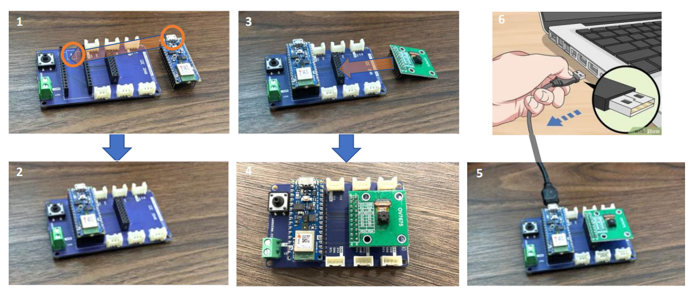
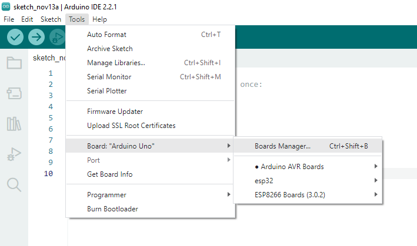
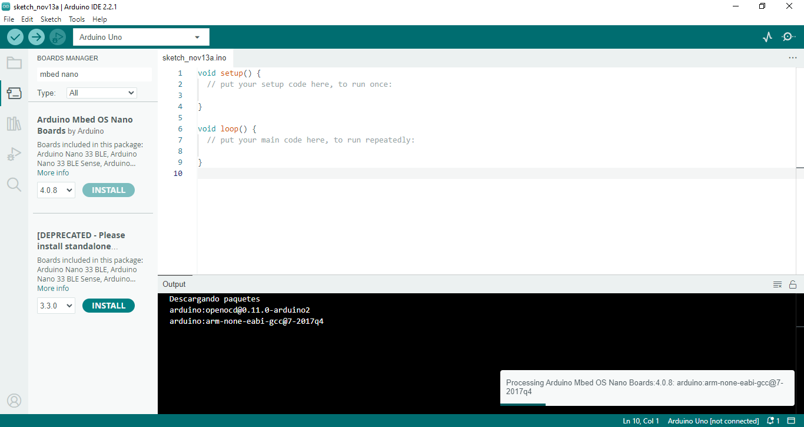
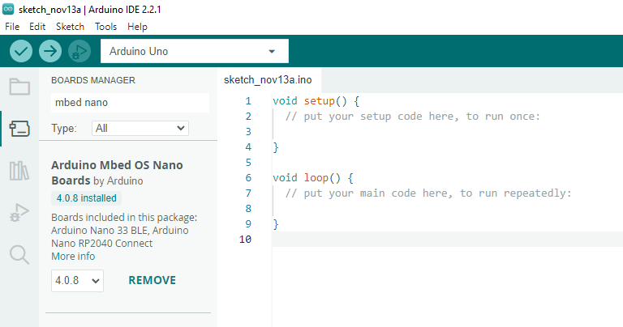
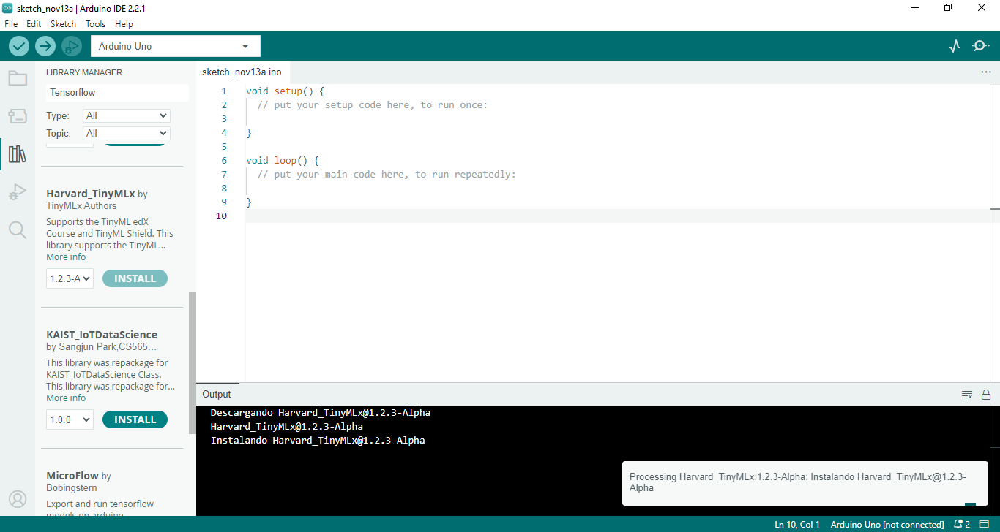
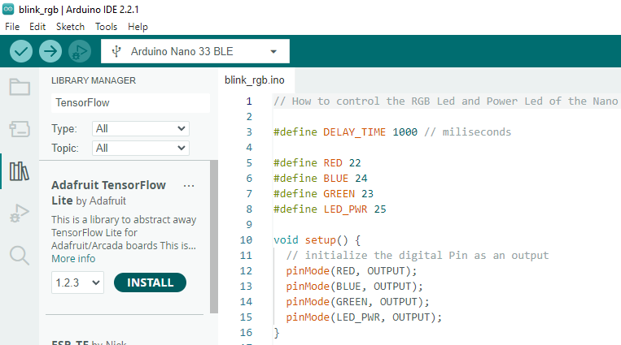
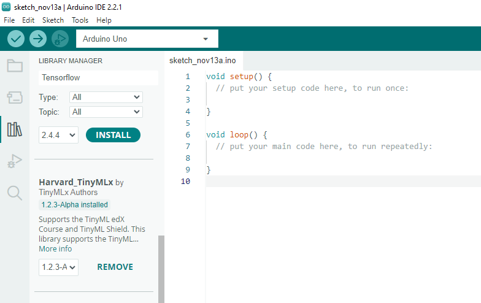
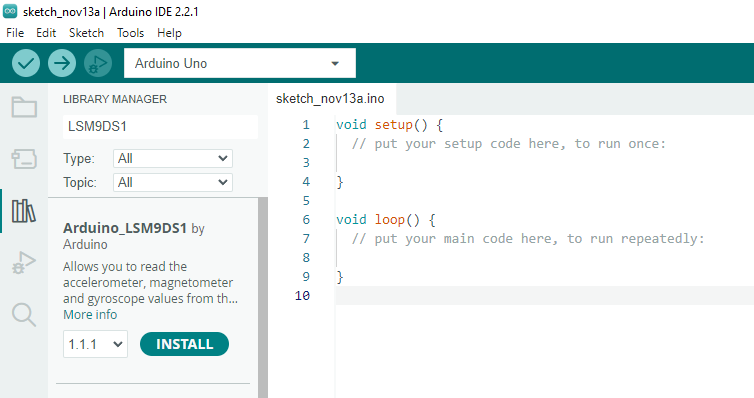
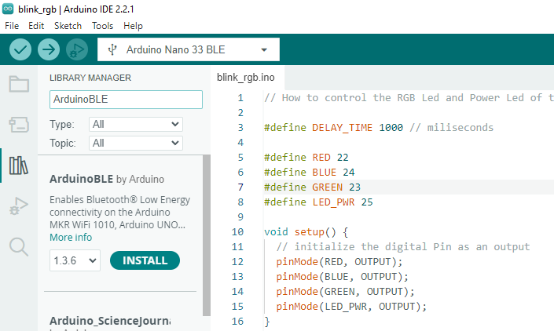

# Arduino ble

## Hardware


Tiny Machine Learning Kid ([link](https://store.arduino.cc/products/arduino-tiny-machine-learning-kit)):
- [x] ARDUINO Nano 33 Ble Sense Lite

  

- [x] Tiny Machine Learning Shield

  


- [x] OV7605 Camera Module ([link](https://store-usa.arduino.cc/products/arducam-camera-module))
  
  


- [x] USB A - Micro USB Cable (1m)


Documento: **Nano 33 BLE Sense** ([link](https://docs.arduino.cc/hardware/nano-33-ble-sense))

De https://tinyml.seas.upenn.edu/ la sección 3 **Getting Started (C++, SW/HW Setup, Sensors)**

La información del kid se encuentra resumida en: 
1. **Tutorial Hardware Assembly** ([link](Tutorial%20The%20TinyML%20Kit%20(Hardware%20Assembly)-1.pdf)))
2. **Tutorial Software Assembly** ([link](Tutorial%20Software%20Assembly.pdf))
3. **Tutorial Step by Step**([link](Tutorial%20Step%20by%20step%20-1.pdf))


https://docs.arduino.cc/hardware/nano-33-ble-sense

## Iniciando a trabajar

Para mas información se siguieron los siguientes documentos:
1. TinyML Kit Overview ([link](https://tinyml.seas.harvard.edu/assets/slides/4D/seminars/22.03.11_Marcelo_Rovai.pdf))
2. 

## Instalación del hardware

En la siguiente figura (tomada del siguiente [link](http://dejazzer.com/eece4710/docs/W62_Setup.pdf)) se muestran los pasos para usar el **Tiny Machine Learning Kid**




## Instalación del software

### Agregar la board

1. Abrir el **Board Manager** a traves del menu desplegable **Boards** (Tools → Board → Boards Manager) 
   
   

2. En el cuadro de texto del **Boards Manager** coloque **mbed nano**. En las opciones que aparecen seleccione la opción **Arduino MBed OS Nano Boards** y proceda a la instalación
   
   
   

   Si la instalación fue exitosa el resultado será similar al mostrado a continuación:
   
   
   
### Instalación de las librerias principes

Para nuestro caso se instalarán las siguientes cuatro librerias:
1. La libreria para **Tensorflow**.
2. La libreria para del curso **Hardvard_TinyMLx**.
3. Libreria para soporte **IMU** para la placa Arduino Nano 33 BLE sense.
4. La libreria **Arduino BLE** 

Para instalar una libreria se sigue el siguiente abre el **Library Manager** siguiendo la ruta: Tools → Manage Libraries. Si todo esta bien, se despliegua el administrador de librerias tal y como se muestra en la siguiente figura:



### Libreria Tensorflow Lite

En el administrador de librerias se puede instalar de acuerdo a la siguiente información:
* Search Term: Tensorflow
* Library Name: Adafruit TensorFlow Lite
* Version: 1.2.3



### Libreria Hardvard_TinyMLx

Libreria del curso **HarvardX Profession Certificate in Tiny Machine Learning (TinyML)** ([link](https://www.edx.org/es/certificates/professional-certificate/harvardx-tiny-machine-learning), [repo](https://github.com/tinyMLx/courseware/tree/master/edX)). En esta libria se incluye la libreria asociada a la arducamara (camera OV767X).

En el administrador de librerias se puede instalar de acuerdo a la siguiente información:
* Search Term: tinyMLx
* Library Name: Hardvard_TinyMLx
* Version: 1.2.3-Alpha



### Libreria Arduino_LSM9DS1

Esta libreria da soporte al IMU (acelerometro, magnetometro y giroscopio) de la board Arduino Nano 33 BLE sense. 

En el administrador de librerias se puede instalar de acuerdo a la siguiente información:
* Search Term: LSM9DS1
* Library Name: Arduino_LSM9DS1
* Version: 1.1.1



### Libreria ArduinoBLE

Libreria que da soporte de conectividad BLE para diferentes placas de arduino entre ellas la placa Arduino Nano 33 BLE sense

* Search Term: ArduinoBLE
* Library Name: ArduinoBLE
* Version: 1.3.6



## Pruebas


Se complemento de aqui:
http://dejazzer.com/eece4710/docs/W62_Setup.pdf


## Primer test

Ver: 
* http://dejazzer.com/eece4710/docs/W62_Setup.pdf
* 


```ino
// the setup function runs once when you press reset or power the board
void setup() {
  // initialize digital pin LED_BUILTIN as an output.
  pinMode(LED_BUILTIN, OUTPUT);
}

// the loop function runs over and over again forever
void loop() {
  digitalWrite(LED_BUILTIN, HIGH);  // turn the LED on (HIGH is the voltage level)
  delay(1000);                      // wait for a second
  digitalWrite(LED_BUILTIN, LOW);   // turn the LED off by making the voltage LOW
  delay(1000);                      // wait for a second
}
```


ss


https://support.arduino.cc/hc/en-us/articles/360016724140-How-to-control-the-RGB-LED-and-Power-LED-of-the-Nano-33-BLE-boards-?queryID=f8337761d7af67e7a4ba29aec63d3949

```ino
// How to control the RGB Led and Power Led of the Nano 33 BLE boards.  

 #define RED 22     
 #define BLUE 24     
 #define GREEN 23
 #define LED_PWR 25

void setup() {

 // initialize the digital Pin as an output
  pinMode(RED, OUTPUT);
  pinMode(BLUE, OUTPUT);
  pinMode(GREEN, OUTPUT);
  pinMode(LED_PWR, OUTPUT);

}

// the loop function runs over and over again
void loop() {
  digitalWrite(RED, LOW); // turn the LED off by making the voltage LOW
  delay(1000);            // wait for a second
  digitalWrite(GREEN, LOW);
  delay(1000);  
  digitalWrite(BLUE, LOW);
  delay(1000);  
  digitalWrite(RED, HIGH); // turn the LED on (HIGH is the voltage level)
  delay(1000);                         
  digitalWrite(GREEN, HIGH);
  delay(1000);  
  digitalWrite(BLUE, HIGH);
  delay(1000);  
  digitalWrite(LED_PWR, HIGH);
  delay(1000);  
  digitalWrite(LED_PWR, LOW);
  delay(1000);  
}
```

https://tinyml.seas.harvard.edu/assets/other/4D/22.03.11_Marcelo_Rovai_Handout.pdf


# Referencias


* https://hackmd.io/@unipd/HkAnHT7b9#13-TinyML-hands-on-examples
* https://tinyml.seas.harvard.edu/courses/
* https://www.datacamp.com/blog/what-is-tinyml-tiny-machine-learning
* https://tinyml.seas.harvard.edu/
* https://machinelearningforkids.co.uk/#!/stories/ml-hasnt-replaced-coding
* http://dejazzer.com/eece4710/index.html#1_intro
* http://dejazzer.com/eece4710/index.html