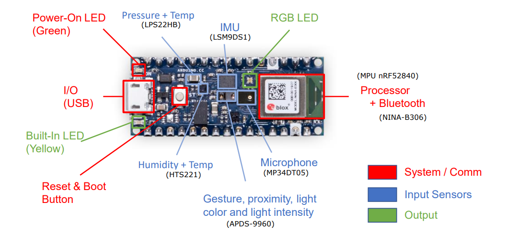
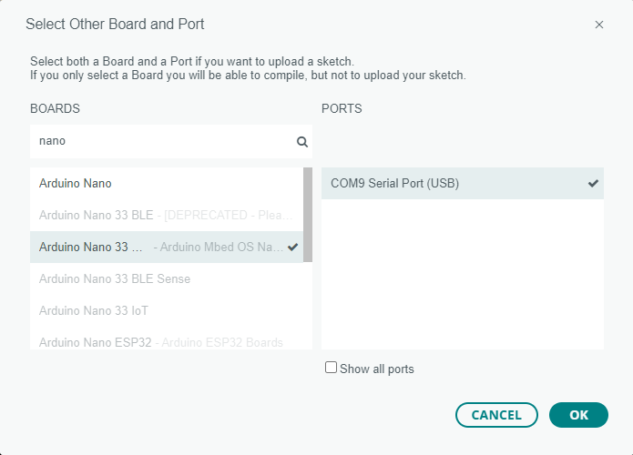
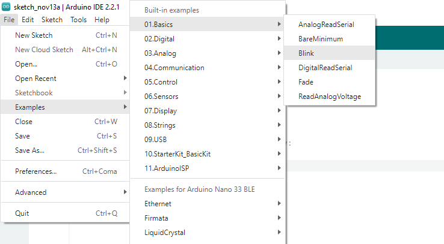

# Arduino ble

## Hardware


Tiny Machine Learning Kid ([link](https://store.arduino.cc/products/arduino-tiny-machine-learning-kit)):
- [x] ARDUINO Nano 33 Ble Sense Lite

  

- [x] Tiny Machine Learning Shield

  


- [x] OV7605 Camera Module ([link](https://store-usa.arduino.cc/products/arducam-camera-module))
  
  


- [x] USB A - Micro USB Cable (1m)


Documento: **Nano 33 BLE Sense** ([link](https://docs.arduino.cc/hardware/nano-33-ble-sense))

De https://tinyml.seas.upenn.edu/ la sección 3 **Getting Started (C++, SW/HW Setup, Sensors)**

La información del kid se encuentra resumida en: 
1. **Tutorial Hardware Assembly** ([link](Tutorial%20The%20TinyML%20Kit%20(Hardware%20Assembly)-1.pdf)))
2. **Tutorial Software Assembly** ([link](Tutorial%20Software%20Assembly.pdf))
3. **Tutorial Step by Step**([link](Tutorial%20Step%20by%20step%20-1.pdf))

A continuación se muestra el Arduino Nano 33 BLE



## Iniciando a trabajar

Para mas información se siguieron los siguientes documentos:
1. TinyML Kit Overview ([link](https://tinyml.seas.harvard.edu/assets/slides/4D/seminars/22.03.11_Marcelo_Rovai.pdf))


## Instalación del hardware

En la siguiente figura (tomada del siguiente [link](http://dejazzer.com/eece4710/docs/W62_Setup.pdf)) se muestran los pasos para usar el **Tiny Machine Learning Kid**


## Instalación del software

### Agregar la board

1. Abrir el **Board Manager** a traves del menu desplegable **Boards** (Tools → Board → Boards Manager) 
   
   

2. En el cuadro de texto del **Boards Manager** coloque **mbed nano**. En las opciones que aparecen seleccione la opción **Arduino MBed OS Nano Boards** y proceda a la instalación
   
   
   

   Si la instalación fue exitosa el resultado será similar al mostrado a continuación:
   
   
   
### Instalación de las librerias principes

Para nuestro caso se instalarán las siguientes cuatro librerias:
1. La libreria para **Tensorflow**.
2. La libreria para del curso **Hardvard_TinyMLx**.
3. Libreria para soporte **IMU** para la placa Arduino Nano 33 BLE sense.
4. La libreria **Arduino BLE** 

Para instalar una libreria se sigue el siguiente abre el **Library Manager** siguiendo la ruta: Tools → Manage Libraries. Si todo esta bien, se despliegua el administrador de librerias tal y como se muestra en la siguiente figura:


### Libreria Tensorflow Lite

En el administrador de librerias se puede instalar de acuerdo a la siguiente información:
* Search Term: Tensorflow
* Library Name: Adafruit TensorFlow Lite
* Version: 1.2.3


### Libreria Hardvard_TinyMLx

Libreria del curso **HarvardX Profession Certificate in Tiny Machine Learning (TinyML)** ([link](https://www.edx.org/es/certificates/professional-certificate/harvardx-tiny-machine-learning), [repo](https://github.com/tinyMLx/courseware/tree/master/edX)). En esta libria se incluye la libreria asociada a la arducamara (camera OV767X).

En el administrador de librerias se puede instalar de acuerdo a la siguiente información:
* Search Term: tinyMLx
* Library Name: Hardvard_TinyMLx
* Version: 1.2.3-Alpha


### Libreria Arduino_LSM9DS1

Esta libreria da soporte al IMU (acelerometro, magnetometro y giroscopio) de la board Arduino Nano 33 BLE sense. 

En el administrador de librerias se puede instalar de acuerdo a la siguiente información:
* Search Term: LSM9DS1
* Library Name: Arduino_LSM9DS1
* Version: 1.1.1


### Libreria ArduinoBLE

Libreria que da soporte de conectividad BLE para diferentes placas de arduino entre ellas la placa Arduino Nano 33 BLE sense

* Search Term: ArduinoBLE
* Library Name: ArduinoBLE
* Version: 1.3.6


## Pruebas

Una vez todos los requisitos para trabajar estan completados vamos a llevar a cabo las pruebas de funcionamiento basicas en la placa tal y como se expone en **TinyML Kit Overview - HW and SW Installation & Test** ([link](https://tinyml.seas.harvard.edu/assets/slides/4D/seminars/22.03.11_Marcelo_Rovai.pdf)). Los pasos para realizar las pruebas se muestran a continuación:
1. Seleccionar la placa y el puerto: en nuestro caso la placa es la Arduino Nano 33 BLE

   

2. Codificar el programa y descargarlo.


### Pruebas basicas

#### Ejemplo 1 - Parpadeo
   
Vamos a ejecutar el ejemplo mas basico y descargalo. Para ello seleccionamos el ejemplo **Blink** en el menú de ejemplos que vienen integrados al IDE (File → Examples → 01.Basics → Blink)



A continuación se muestra el codigo del ejemplo:

```ino
// the setup function runs once when you press reset or power the board
void setup() {
  // initialize digital pin LED_BUILTIN as an output.
  pinMode(LED_BUILTIN, OUTPUT);
}

// the loop function runs over and over again forever
void loop() {
  digitalWrite(LED_BUILTIN, HIGH);  // turn the LED on (HIGH is the voltage level)
  delay(1000);                      // wait for a second
  digitalWrite(LED_BUILTIN, LOW);   // turn the LED off by making the voltage LOW
  delay(1000);                      // wait for a second
}
```

#### Ejemplo 2 - Parpadeo led RGB

Este ejemplo se tomo de la pagina **How to control the RGB LED and Power LED of the Nano 33 BLE boards?** ([link](https://support.arduino.cc/hc/en-us/articles/360016724140-How-to-control-the-RGB-LED-and-Power-LED-of-the-Nano-33-BLE-boards-?queryID=f8337761d7af67e7a4ba29aec63d3949)). A continuación se muestra el código implementado:

```ino
// How to control the RGB Led and Power Led of the Nano 33 BLE boards.  

 #define RED 22     
 #define BLUE 24     
 #define GREEN 23
 #define LED_PWR 25

void setup() {

 // initialize the digital Pin as an output
  pinMode(RED, OUTPUT);
  pinMode(BLUE, OUTPUT);
  pinMode(GREEN, OUTPUT);
  pinMode(LED_PWR, OUTPUT);

}

// the loop function runs over and over again
void loop() {
  digitalWrite(RED, LOW); // turn the LED off by making the voltage LOW
  delay(1000);            // wait for a second
  digitalWrite(GREEN, LOW);
  delay(1000);  
  digitalWrite(BLUE, LOW);
  delay(1000);  
  digitalWrite(RED, HIGH); // turn the LED on (HIGH is the voltage level)
  delay(1000);                         
  digitalWrite(GREEN, HIGH);
  delay(1000);  
  digitalWrite(BLUE, HIGH);
  delay(1000);  
  digitalWrite(LED_PWR, HIGH);
  delay(1000);  
  digitalWrite(LED_PWR, LOW);
  delay(1000);  
}
```

### Pruebas sensores

#### IMU

https://github.com/tinyMLx/arduino-library/tree/main/examples/test_IMU


```ino
#include <Arduino_LSM9DS1.h>

int imuIndex = 0; // 0 - accelerometer, 1 - gyroscope, 2 - magnetometer
bool commandRecv = false; // flag used for indicating receipt of commands from serial port
bool startStream = false;

void setup() {
  Serial.begin(9600);
  while (!Serial);

  // Initialize IMU
  if (!IMU.begin()) {
    Serial.println("Failed to initialize IMU");
    while (1);
  }

  Serial.println("Welcome to the IMU test for the built-in IMU on the Nano 33 BLE Sense\n");
  Serial.println("Available commands:");
  Serial.println("a - display accelerometer readings in g's in x, y, and z directions");
  Serial.println("g - display gyroscope readings in deg/s in x, y, and z directions");
  Serial.println("m - display magnetometer readings in uT in x, y, and z directions");
}

void loop() {
  String command;

  // Read incoming commands from serial monitor
  while (Serial.available()) {
    char c = Serial.read();
    if ((c != '\n') && (c != '\r')) {
      command.concat(c);
    } 
    else if (c == '\r') {
      commandRecv = true;
      command.toLowerCase();
    }
  }

  // Command interpretation
  if (commandRecv) {
    commandRecv = false;
    if (command == "a") {
      imuIndex = 0;
      if (!startStream) {
        startStream = true;
      } 
      delay(3000);
    }
    else if (command == "g") {
      imuIndex = 1;
      if (!startStream) {
        startStream = true;
      }
      delay(3000);
    }
    else if (command == "m") {
      imuIndex = 2;
      if (!startStream) {
        startStream = true;
      }
      delay(3000);
    }
  }


  float x, y, z;
  if (startStream) {
    if (imuIndex == 0) { // testing accelerometer
      if (IMU.accelerationAvailable()) {
        IMU.readAcceleration(x, y, z);
  
        Serial.print("Ax:");
        Serial.print(x);
        Serial.print(' ');
        Serial.print("Ay:");
        Serial.print(y);
        Serial.print(' ');
        Serial.print("Az:");
        Serial.println(z);
      }
    }
    else if (imuIndex == 1) { // testing gyroscope
      if (IMU.gyroscopeAvailable()) {
        IMU.readGyroscope(x, y, z);
  
        Serial.print("wx:");
        Serial.print(x);
        Serial.print(' ');
        Serial.print("wy:");
        Serial.print(y);
        Serial.print(' ');
        Serial.print("wz:");
        Serial.println(z);
      }
    }
    else if (imuIndex == 2) { // testing magnetometer
      if (IMU.magneticFieldAvailable()) {
        IMU.readMagneticField(x, y, z);
  
        Serial.print("Bx:");
        Serial.print(x);
        Serial.print(' ');
        Serial.print("By:");
        Serial.print(y);
        Serial.print(' ');
        Serial.print("Bz:");
        Serial.println(z);
      }
    }
  }
}
```

#### Microfono

https://github.com/tinyMLx/arduino-library/tree/main/examples/test_microphone


```ino
/*
  Active Learning Labs
  Harvard University 
  tinyMLx - Built-in Microphone Test
*/

#include <PDM.h>
#include <TinyMLShield.h>

// PDM buffer
short sampleBuffer[256];
volatile int samplesRead;

bool record = false;
bool commandRecv = false;

void setup() {
  Serial.begin(9600);
  while (!Serial);  

  // Initialize the TinyML Shield
  initializeShield();

  PDM.onReceive(onPDMdata);
  // Initialize PDM microphone in mono mode with 16 kHz sample rate
  if (!PDM.begin(1, 16000)) {
    Serial.println("Failed to start PDM");
    while (1);
  }

  Serial.println("Welcome to the microphone test for the built-in microphone on the Nano 33 BLE Sense\n");
  Serial.println("Use the on-shield button or send the command 'click' to start and stop an audio recording");
  Serial.println("Open the Serial Plotter to view the corresponding waveform");
}

void loop() {
  // see if the button is pressed and turn off or on recording accordingly
  bool clicked = readShieldButton();
  if (clicked){
    record = !record;
  }
  
  // see if a command was sent over the serial monitor and record it if so
  String command;
  while (Serial.available()) {
    char c = Serial.read();
    if ((c != '\n') && (c != '\r')) {
      command.concat(c);
    } 
    else if (c == '\r') {
      commandRecv = true;
      command.toLowerCase();
    }
  }

  // parse the command if applicable
  if (commandRecv && command == "click") {
    commandRecv = false;
    record = !record;
  }

  // display the audio if applicable
  if (samplesRead) {
    // print samples to serial plotter
    if (record) {
      for (int i = 0; i < samplesRead; i++) {
        Serial.println(sampleBuffer[i]);
      }
    }
    // clear read count
    samplesRead = 0;
  } 
}

void onPDMdata() {
  // query the number of bytes available
  int bytesAvailable = PDM.available();

  // read data into the sample buffer
  PDM.read(sampleBuffer, bytesAvailable);

  samplesRead = bytesAvailable / 2;
}
```


#### Ejemplo Camara

En construcción

## Referencias principales

Para los ultimos ejemplos nos estamos basando en: 

* http://dejazzer.com/eece4710/docs/W63_Testing.pdf
* https://tinyml.seas.harvard.edu/assets/other/4D/22.03.11_Marcelo_Rovai_Handout.pdf
* http://dejazzer.com/eece4710/docs/W62_Setup.pdf
* http://dejazzer.com/eece4710/docs/W63_Testing.pdf

## Pendiendes

- [ ] Programar los ejemplos usando platformio

Ver:
* https://sensiml.com/documentation/firmware/arduino-nano33/arduino-nano33.html
* https://www.edgeimpulse.com/blog/platformio
* https://kevinxli.medium.com/manage-two-arduinos-with-ease-using-platformio-4f83ad4a8868
* https://www.cs.cmu.edu/~sensing-sensors/
* http://dejazzer.com/eece4710/docs/W7_Assignment.pdf
* https://github.com/gigwegbe/tinyml-papers-and-projects
* https://registry.platformio.org/libraries/tinymlx/Harvard_TinyMLx
* https://edgeimpulse.com/blog/platformio
* https://www.hackster.io/news/easy-tinyml-on-esp32-and-arduino-a9dbc509f26c
* https://eloquentarduino.com/
* https://gist.github.com/peopzen/ce7eaa229ed408d1b4c63f4a4ac8c12b

## Referencias

* http://dejazzer.com/eece4710/docs/W63_Testing.pdf
* https://tinyml.seas.harvard.edu/assets/other/4D/22.03.11_Marcelo_Rovai_Handout.pdf
* https://hackmd.io/@unipd/HkAnHT7b9#13-TinyML-hands-on-examples
* https://tinyml.seas.harvard.edu/courses/
* https://www.datacamp.com/blog/what-is-tinyml-tiny-machine-learning
* https://tinyml.seas.harvard.edu/
* https://machinelearningforkids.co.uk/#!/stories/ml-hasnt-replaced-coding
* http://dejazzer.com/eece4710/index.html#1_intro
* http://dejazzer.com/eece4710/index.html